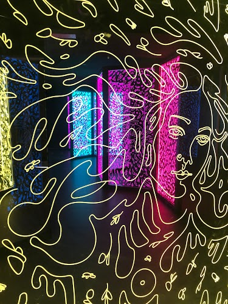
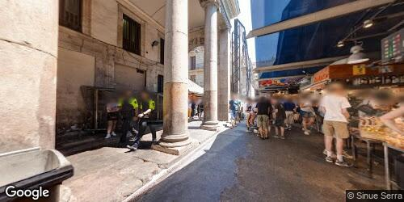
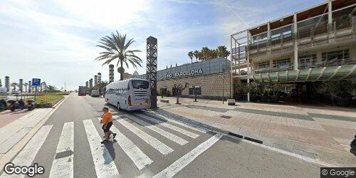

## Diary of a (Google Maps) Trip to Barcelona, Spain

You've arrived in Barcelona, Spain, alone and ready to start your paranormal investigation. You've heard stories of ghosts and poltergeists haunting the city's many historic buildings and narrow, winding streets. You're eager to explore the city's haunted hotspots, like the Gothic Quarter and the old Jewish quarter. You're also planning to visit the city's many museums and historical sites, hoping to find clues to the city's ghostly past. You can't wait to get started!

## Day 1

Tonight you'll be sleeping here: _Majestic Hotel & Spa Barcelona_ 

ImageAuthor: _Majestic Hotel & Spa Barcelona_ 

The guide says: "*Grand, storied hotel featuring a sophisticated restaurant, bars & a spa, plus a rooftop pool.*"

Original Review Source

Luxury experience, best staff and very polite and professional! Great training to all staff. AC was perfect, area is amazing. They addressed an issue we had with bathroom fan and moved us to another room right away. Very friendly! Roof top bar/restaurant was beautiful views and good drinks/food. Loved the vibe! Safety for guests was excellent. Need key to get into elevator! Many greeters and security at front door for safety and welcome! 

You write about it in your journal:

>Diary Entry:		Adventures in Barcelona took me to a luxury destination today, nestled in an utterly fantastic area. I found myself stepping into class and professionality. The staff wore their training like a mantle, a perfect blend of kindness and proficiency shimmered from them, a definite contrast from the eerie places I usually dwell in search of my spectral prey.		An unexpected turn of events occurred when I detected an unceasing sound from the bathroom fan in my room; the relentless "whirring" vaguely mimicked spectral whispers from past explorations. The staff was prompt in their action and offered a room change swiftly. They moved through it all like seasoned spirit wardens, always mindful of my comfort and always friendly - this gesture broke the routine solitude my paranormal investigations typically include. 		An evening visit took me to the stunning roof-top bar/restaurant. The vista was a masterpiece, splashed with vibrant Spanish hues, a treat indeed compared to the ephemeral views I encounter on my spectral hunts. The drinks and food matched the panorama with their excellence. Basking in this inviting vibe brought respite from the disturbing encounters I'm accustomed to in my unique line of work. 		The attention to safety was impressive – almost reminiscent of my need for protection from unwelcome spectral activity. They've thought through it all – even activating the elevator required a key! The frequent greeters and security at the front door reassured me further. Paranormal or not, solace comes easy when greeted with such warmth amidst vigilant eyes securing your wellbeing. Today's experience was quite different yet fascinating; another day in Barcelona defying my typical spectral pursuit... Yet who said ghosts don't dwell in luxury too, right?

You rate it a 5.

Your post on Facebook says:

>*Today I had an amazing time at a luxury hotel! The staff was super friendly and professional, and they even addressed an issue we had with the bathroom fan right away. The AC was perfect, and the area was amazing.*

You post a random snap of the sights to make your friends jealous:

***

As you stroll through the sunlit streets of Barcelona, a sense of anticipation tingles in the air around you. The cheerful chatter of locals enjoying their morning coffee fills your ears, intermingled with the occasional sound of a passing bicycle bell. The warm rays of sunlight kiss your skin, filling you with a renewed energy and a heightened sense of purpose. You can't help but imagine the hidden corners of this city, where supernatural secrets might be lurking. With each step, you find yourself growing more excited about the prospect of uncovering the spirits that may reside here. A quick glance around reveals intriguing Gothic architecture and narrow alleyways just begging to be explored. Perhaps there is a haunted building nearby waiting for your attention, or a local legend with a dark tale that has yet to be fully unraveled. The possibilities seem endless as you continue your search for the paranormal in this spirited city.

So you decide to spend a few hours here: _Magic Fountain of Montjuïc_ 

ImageAuthor: _Rap Roanne_ 

The guide says: "*Huge circular fountain renowned for its scheduled shows of water & light choreographed to music.*"

Original Review Source

The view from both bottom and top was breath taking. Could get a very nice view of the city. Unfortunately could not see the fountain show because the Fountain was temporary closed. But definitely worth visiting especially when it gets dark in the evening! 

You write about it in your journal:

>Diary Entry:		As the sun began to descend and darkness enveloped the city, I found myself on a hill in Barcelona. A shiver ran down my spine not from the gentle evening breeze, but anticipation. I was surrounded by a panorama that took my breath away, offering up hues of fading sunset hues melting into the deep blue of twilight. The view: from the bottom and top was simply majestic, I could see the city naked, in all its evening splendor. I savored the sight, temporarily forgetting my purpose here. My intention was to witness the famed fountain show, a spectacle rumored to entertain not just tourists but a ghostly spectator or two as well. Unluckily for me, as fate would have it, my search for the paranormal fell short; the visual jewel of Barcelona was temporarily closed. Slightly disheartened yet a tad relieved, I shrugged off the missed adventure, grateful for the unique experience. While my ghost chasing endeavor was put on pause, the awe-inspiring view under Barcelona's velvet black skies undoubtedly satiated my thirst for excitement and discovery - at least for now. Can these urban legends be another folklore or does supernatural manacles really bind this city? As twilight fades into darkness, I'm left wondering, about the unseen world that hides in the shadows of this breath-taking cityscape...

In any case, you leave them a 5 rating.

Your post on Facebook says:

>*Today I went to check out the Bellagio fountains and although I missed the show, the views from the top and the bottom of the fountains were breath taking 🤩🌃!  #VegasBaby #BellagioFountains*

You get a bite here: _7 Portes_ 

ImageAuthor: _Kaman Kwok_ 

The guide says: "*Old-world space with checkered floors & wood beams, offering seafood dishes & classic paella.*"

Original Review Source

A restaurant we visit every time we come to Barcelona. It has an extensive menu. Although it is a place mostly visited by tourists, it is also possible to come across cheerful Spanish customers. There is a website for booking and it works. Since it is a large venue, you have the chance to find a seat during non-crowded periods. The pianist at the venue will make the gesture of playing a song for you if you give him the notes. In my opinion, the most important difference compared to new generation restaurants is that it does not put the service quality it provides to its customers in the background because it serves good food and has a proven reputation. 

You write about it in your journal:

>Diary Entry:		In the midst of bustling Barcelona, venturing into an enormously engaging restaurant was an enticing detour from paranormal pursuits. As I stepped foot inside this culinary haven, the meticulously extensive menu piqued my curiosity. It was comfortably crowded with jovial patrons, both tourists and locals who reveled in the convivial atmosphere with unmuted cheer. 		A bucolic charm permeated the venue, maintained harmoniously despite its grandeur and crowd capacity. Leveraging an efficient online booking system, it was interesting to note the amalgamation of antique allure with modern technological twists.		The centerpiece of the venue was indisputably unbeatable - a pianist, poised elegantly near the velvety, grandeur curtains. With beneficial fortune, vacating the discomfort of the haunting daybreak at bat city caves and otherworldly mystifications at Spanish monasteries later that evening, I handed him my favorite tango piece. His maestro-like rendition rejuvenated my resolve for the hunt lying ahead, cooling heated nerves scorched by today's eerie realizations.		Alongside spellbinding ambiances and toe tapping music, another commendably impressive aspect was its care for service. Despite sun-setting Barcelona being magnetized to bask in its stories of repast spirit famines and culinary reputation, it never failed to pamper every customer with a quality service intact- a true example of not letting the foreground of flavours overshadow service supremacy. Tonight, however feasting wasn't about earthly food fights against an ethereal adversary or coaxing confessions from a cocky poltergeist at dessert, it was about barely corporeal serenity and surprisingly inviting - normality!

You consider this a 4 star visit.

Your post on Facebook says:

>*Had an amazing time at this restaurant in Barcelona 🇪🇸! The food was delicious 😋 and the service was impeccable 👌. The pianist even played a song for us 🎹🎶. Highly recommend! 🌟🌟🌟🌟🌟*

You post a random snap of the sights to make your friends jealous:

***

As snow softly falls from the sky, Barcelona feels eerily hushed beneath its wintry veil. Walking the bustling streets adorned with Spanish architecture, you can't help but feel a sense of anticipation tinged with trepidation. The vibrant city comes alive with the fervor of its inhabitants going about their daily lives, oblivious to the supernatural secrets that may lurk in the shadows. The rhythmic sound of church bells resonates through the air, heightening your curiosity and fueling your desire to delve deeper into the paranormal investigations. With each step, the chill in the air sends a shiver down your spine, reminding you that the realm of ghosts and poltergeists may be closer than you think. Your eyes dart around, searching for any signs or clues as you contemplate seeking out haunted locations, abandoned buildings, or ancient cemeteries. The snow-covered streets beckon you to uncover their haunting mysteries and embrace the captivating realm of the unknown.

So you decide to spend a few hours here: _IKONO Barcelona_ 

ImageAuthor: _Roma Buda_ 

Original Review Source

Friendly employees! Many different rooms to explore! I loved the smell too lol! A great place to take a bunch of photos for social media! Dress cute and grab your ticket! The ticket is $18+ tax. 

You write about it in your journal:

>Diary Entry: 		While tracking eldritch activity in Spain, an unscheduled encounter led me to an exceedingly sympathetic group of locals today. Their sparkling eyes begged tales of the unseen whose whispers I trace, which I did share, over numerous steaming cups of café con leche. How invigorating it was to brush shoulders with the living on my journey into the unknown! The place they led me to was a labyrinth; chamber after chamber filled with curios and anomalies. It housed earthly wonders whose scent intoxicated the weary traveler in me, withdrawing me temporarily from my ethereal pursuit. This departure rewarded me with myriad striking backdrops that presented ideal settings for pictures, haunting details meticulously made ethereal by the low camera flash. So infused I got in capturing this momentary distraction that I almost neglected the unnerving chill of my more familiar spectral footprints! Ostensibly a played rogued act, yet an unforeseen intermission in my spectral voyage that registered an uncanny $18 psychic stroke. The citizens of this realm continue to surprise me with their intrigue and charm. They prove a beneficial diversion, adding unexpected layers to my harrowing journey of courting the invisible.

You rate it a 5.

Your post on Facebook says:

>*Had an amazing time exploring the many rooms at the Museum of Ice Cream today!🍨 The employees were so friendly and the place smelled incredible!📸✨ I highly recommend dressing cute and taking lots of photos for your social media! 🤳🏼The ticket is $18+ tax, but it's worth it for the experience! ☀️✨*

## Day 2

Tonight you'll be sleeping here: _H10 Marina Barcelona_ 

ImageAuthor: _H10 Marina Barcelona_ 

The guide says: "*Refined rooms & suites, some with city views, in a polished hotel offering dining & a rooftop pool.*"

Original Review Source

A superb base to explore this beautiful amazing city.  A lovely hotel, with staff who go above and beyond their roles. A special mention for Aleix, who we communicated with prior to arrival.  Wonderful to deal with & a credit to the team. Junior Suite room with balcony was amazing. Easy access to the rooftop pool.  Stunning views. Superb variety at breakfast.  The staff were so welcoming and friendly. Spa & pool were both perfect.  Again, the spa staff were great to deal with. Overall cleanliness of the hotel is excellent. No complaints whatsoever. We will definitely return to explore more. 

You write about it in your journal:

>Diary Entry: 		The moment I stepped into the pristine hotel in the heart of Barcelona, I immediately felt welcomed by the sincere attentiveness of the staff. They were ready to go the extra mile to provide the best service, notably with Aleix, who's been assisting me anxiously before I arrived. With his pleasant demeanor, I instantly appreciated his efforts and commitment. 		My adrenaline ran high when I unpacked my equipment in my remarkable Junior Suite with a balcony overlooking the city view. There was something uniquely different here, as if my line of work was more than welcome under its roofs.		A unique moment unfurled when I wandered up to the rooftop pool, offering a view of a sun-drenched Barcelona; it was then a fleeting unseen presence brushed past me- an unseen touch that had me up in alertness. The entity seemed drawn to the beauty of its own memory of this city life, as I slowly munched thrillingly on the superb spread of breakfast should in front of me the next morning. 		The ambience at the spa was tranquil and strangely comforting. As the sweet scent of essential oils filled the room, I interacted with courteous staff who had jovial spirits themselves - yet, spectrally this was another hotspot! Visitors might have taken it as a calming retreat, but my senses tingled at every spectral whisper seeming favorite amongst unseen residents as well.		The overall cleanliness of this place challenged me. There weren't many haunted places this neat! Yet, strangely enough, it had fascinating energy mingling in its corridors promising more explorations into the phantom world. 		Definitely coming back just to see if every visit here makes Barcelona's spirits more lively every time.

You rate it a 5.

Your post on Facebook says:

>*What a superb base to explore this beautiful city!  A lovely hotel, with staff who go above and beyond - special mention for Aleix, who we communicated with prior to arrival.  Wonderful to deal with & a credit to the team. Junior Suite room with balcony was amazing. Easy access to the rooftop pool with stunning views. Superb variety at breakfast.  The staff were so welcoming and friendly. Spa & pool were both perfect.  No complaints whatsoever. We will definitely return to explore more. #barcelona #spain #vacation #travel #explore #amazing #beautiful #city #hotel #staff #friendly #helpful #views #food #breakfast #pool #relax*

You post a random snap of the sights to make your friends jealous:

***

As you wander the snow-covered streets of Barcelona, your mood weighs heavy on your heart. The haunting snowflakes fall gently upon your face, mirroring the melancholy that lingers within you. Stepping away from the energetic hustle and bustle of the city, you find solace amidst the quiet eeriness of the narrow alleyways. The old Gothic architecture that surrounds you takes on an ethereal glow in the soft light of the snowfall, giving birth to a sense of mystery. You can't help but think that this wintry weather could be an opportunity to uncover long-forgotten tales of paranormal activity in this ancient city. Perhaps seeking out local legends and stories from the locals will provide you with the insights you need to explore the ghostly whispers that linger in the corners of Barcelona's hidden nooks and crannies.

So you decide to spend a few hours here: _El Corte Inglés Diagonal_ 

ImageAuthor: _José Alberto Padrón Navarta_ 

Original Review Source

The grocery section is great. You'll get everything you want. They are a bit costlier than other places but that's the price you pay when you get everything at one place in a well maintained state. 

You write about it in your journal:

>Dear Diary, 	Today whilst sauntering through the labyrinths of Barcelona, I mysteriously found myself courted by the extensive grocery section of an aged store; a place that starkly stood out amidst the ancient charisma of this city. The air was thick with an invisible energy buzzing around, potentially the echoes of past presences when they were alive. The shelves were bejeweled with a dazzling range of artifacts; it seems like vortex where one could procure everything and anything known to man. Sure it's a bit pricier than your mundane supermarkets, but isn’t it worth the extra coin when you're touching bottles of olives potentially haunted by the ghosts past owners? The lavishness also comes from its well-maintained state, almost regally deterring dust and decay. Now, the question lingers: was this merely an immaculate grocery section or a subtle disguise for an epicenter of the otherworldly? Tomorrow's investigation awaits.

In any case, you leave them a 4 rating.

Your post on Facebook says:

>*At the grocery section and it's a one-stop shop! Prices are a bit high, but you get what you pay for. Well-maintained and great selection  🛒*

You get a bite here: _Honest Greens Tuset_ 

ImageAuthor: _Frank Kasa_ 

Original Review Source

This location was buzzing and quite a big store. We ordered the pepper lemon chicken salad plate and chimichurri steak salad plate. The wait was short and the food delicious and nutritious. Meals were delivered to the table when ready and plenty of staff around the dining area to keep the tables  clean. 

You write about it in your journal:

>Diary Entry: The chilling, pulsing energy was impossible to escape in the vast, vast area of the location. Skepticism always accompanies me on such attempts but it was pushed to the background after my specialized equipment picked up some strange electromagnetic readings. To boost my spirits, and rebalance myself from all the energies stirring around, I decided to indulge in their refreshing pepper lemon chicken salad - an instant delight to the tongue. My taste buds were endeared by the chimichurri steak salad, after that short wait. The moment when my meal was delivered - that’s when it happened! Shadows danced unnaturally around the corners, and a cold wind flowed right in sync with the diligent staff crisscrossing to maintain cleanliness around me. In this oddly bustling place, beneath all the ordinary, hospitality revelations, a ghostly performance was at play more delicious and nutritious to my hunt than any salad plate.

In any case, you leave them a 5 rating.

Your post on Facebook says:

>*At this bustling location, we indulged in the zesty flavors of the pepper lemon chicken salad and the savory chimichurri steak salad 🍋🥩🥗 The quick service and attentive staff made the experience even more enjoyable. With meals delivered promptly and tables kept spotless, it was a delightful dining affair!  #TastyTreats #HappyTummies 😋👌*

You post a random snap of the sights to make your friends jealous:

***

As the snow gently falls on the historic streets of Barcelona, a sense of somberness blankets the air. The chilly weather matches your low mood, making you all the more determined to uncover the mysteries that lie within this enchanting city. While the sound of laughter and chatter fills the narrow alleys, your senses are heightened, searching for any signs of the supernatural. As you pass by ancient buildings adorned with Gothic architecture, you can't help but envision the memories and stories these walls hold. The packed cafes and cozy bars offer solace from the cold, tempting you to gather locals' tales of ghostly encounters over a warm cup of coffee. Lost in your thoughts, you feel a thrill of anticipation, knowing that within this vibrant city lies a hidden world, waiting to be explored by a curious and daring investigator like yourself.

So you decide to spend a few hours here: _HUMANA Vintage_ 

ImageAuthor: _Sari_ 

Original Review Source

Amazing! Jackets, jeans, tops. The jeans area is huge and got sooo much to look at! Great quality and staff🩷💜💙 

You write about it in your journal:

>Entry:		Decided to temporarily suspend my ghost hunt and sauntered into a local retail shop instead. Piles of jackets, jeans, and tops met my humbled vision; it was like stepping foot inside a cavernous wardrobe of a duchess. The sheer size of the jeans section left me a tad dumbfounded. Endless rows, myriad shades; it was a beguiling cornucopia of blue fabrics! Stationed in the luxurious heart of denim galore, I was seized by the subtly thrilling sensation as my senses were flooded with hues and textures. Separately, I received an unanticipated, but no less appreciated interaction with the earthly realm in the form of delightful store staff. Their loving warmth rivaled even the friendly spirits I'd encountered earlier elsewhere in Barcelona. But I never forgot why I was really here; looking for the enigmatic unseen; the ghosts that reside in odd places like this bustling City of Counts, still unaware they have customers to attend to. It was an unexpected and thoroughly entertaining twist in my paranormal chase through Barcelona.

You consider this a 5 star visit.

Your post on Facebook says:

>*Had an amazing time shopping today!🧥👕👖 The jacket and jeans selection was huge with great quality and staff! Definitely recommend checking it out! 🛍️ #jeans #jackets #tops #ootd*

## Day 3

Tonight you'll be sleeping here: _St Christopher's Inn | Hostel in Barcelona_ 

ImageAuthor: _St Christopher's Inn | Hostel in Barcelona_ 

The guide says: "*Relaxed dorms & rooms in a hip property with free breakfast, plus a laid-back bar & restaurant.*"

Original Review Source

Some staff are extremely unhelpful. You can’t even imagine. All of your requests will be rejected trust me. They will charge you for everything. Even for a minute. They are saying, we are backpackers hostel, really? because I thought other hostels are for businessman. They don’t offer any solutions, just repeat same nonsense over and over again. You can’t even extend your stay easily. There are rules and rules. But rules only valid when you ask something, otherwise no one cares. But when you say anything, they are like you disrespect to us. Looks like they are very emotional and fragile. Should I listen the same speech fifth time? I am trying to extent my stay but the guys in the reception is talking about cleaners. Impossible to sleep well because of noise. Location looks good but just on the map. There are better places for better prices with better location. 

You write about it in your journal:

>Journal Entry:		Dear Diary, 		Today, was another intriguing day in my quest for the ethereal. As an established paranormal investigator, I wanted to tap into energies and memories sanitized boutique hotels never harbor. Hence, the pick of a backpacker’s hostel to settle in, comfortable with chaos; perhaps a petri-dish for poltergeists?		Frustratingly, every interaction was enunciated with a touch of hostility. I found it uncanny- the outward rebellion against requests or negotiations. Especially, any attempt to elongate my stay became an oratorial match against the surly receptionist, standing as firmly as if guarding the gates of Fort Knox. By the by, did I disrespect the unresponsive lobby coffee machine that took an eternity to spew out thinly caffeinated water? Who could tell from their perspective.		Beyond human absurdities, a recurrent noise ensued throughout the night, threatening my REM cycle's integrity. Was it just an echo of Galactic-level partying over thin hostel walls, or could that be my elusive quarry - spectral substance amidst sonic static? I'd need caffeine clarity to delve.		Initial_eccentricity melted into disappointment when I measured the locale with my footsteps and found the actual distance inclined liberally away from the nominal.PIcked off almost-enlightened bright spots, identifying-better-positioned-yet-affordable establishments from my vantage. The noise did mellow- replaced with inexplicable chills winding down my spine. Tomorrow’s another day. Guess even Parabusters need their ZZZs!		Fondly,		Your very human entity

In any case, you leave them a 1 rating.

Your post on Facebook says:

>*I'm having a great time at this hostel! The staff is super friendly and helpful, and they're always willing to go the extra mile to make sure my stay is enjoyable.*

You post a random snap of the sights to make your friends jealous:

***

As the bright rays of the Barcelona sun dance on the vibrant streets, you can't help but feel a tinge of melancholy as you wander through the bustling city. The lively chatter of locals fills your ears, accompanied by the rhythmic music pouring out of nearby cafes. The warm breeze brushes against your skin, reminding you of the task at hand. Perhaps you could explore the city's haunted past, visiting old buildings rumored to be haunted or stopping by eerie locations with chilling stories. A visit to Montjuïc Cemetery might uncover supernatural secrets or a walk through the ancient Gothic Quarter could reveal hidden poltergeist hotspots. Barcelona is an enigma waiting to be unraveled, and your quest for ghosts and poltergeists is just beginning.

So you decide to spend a few hours here: _Montjuïc Castle_ 

ImageAuthor: _Damien VALAIRE SAFTI_ 

The guide says: "*17th-century hilltop fortress & former prison, housing a military museum with impressive city views.*"

Original Review Source

It’s a pretty nice historic place to visit with lots of information available. It offers nice views over the city of Barcelona as well as over the port. There is a small restaurant available inside the castle with seatings outside - very nice place for a break. It was not very crowded so it was really a nice break from the vivid city life. 

You write about it in your journal:

>Diary Entry:		Today's investigation fell upon a strikingly beautiful, historic castle showcased in my research -- where by the sounds of creaking timbers and fleeting whispers overcame me. It towered with significance, perched high above, allowing an expansive view of Barcelona and its bustling port. The aura of the castle clung tightly with traces of a bygone era with every stone piece and artifact narrating a compelling history which I feverishly absorbed. Inspecting every corner of it stirred echoes of stories begging to unfold. 		During a brief pause mid-investigation, I stumbled included onto a charming little restaurant tucked away within the castle's protective high walls. The surreal experience piqued as I took a seat in their outdoor setup, the ancient structure and the subsequent tales oxidizing with my every sense, imprinting an uninterrupted image of the scene that lay in front of me. The soft clinking of dishes inside carrying cryptic undertones was my loose link to the living world distant through the silence of the castle void. 		In stark contrast to Barcelona's life-filled streets, the emptiness here stirred a flurry of eery sensations that made today's quest for supernatural sightings beyond intriguing. Surely, my day in this castle was a much-required hiatus from the omnipresent city vibrancy, but more thrillingly, an immersive plunge into my adorable chaotic world of ghosts and poltergeists.

You shrug and leave a 5 review.

Your post on Facebook says:

>*Beautiful views over Barcelona and the port from this historic and not-so-crowded place 🏰🍝 #Barcelona #castle #views*

You get a bite here: _Shôko_ 

ImageAuthor: _Shôko Barcelona - Restaurant & Lounge Club_ 

The guide says: "*Global dishes in an elegant restaurant with a terrace & sea views, plus a club with DJs & dancing.*"

Original Review Source

Went there for the night club experience. The place was packed. For me there was a little too much people there, but the vibe is nice! There is a big dance floor 💃🏽🪩 We brought a ticket for 20 euros that covered  entrance and 2 drinks. 

You write about it in your journal:

>Diary Entry:	Tonight, I delved into the throbbing heart of the Barcelona nightlife, on an extraordinary assignment. The focus - this infamously popular nightclub I'd been told was swarming with enigmatic energies. Spirits drawn to the beat, perhaps? 		The atmosphere was vividly atmospheric with a swarm of bodies, an ocean of kinetic energy. Whilst it is a expert investigator's ideal, the sheer vast crowd was a bit overwhelming for my taste. Nevertheless, I instantly noted the surprisingly uplifting vibe of this place. It clearly enjoyed delivering revelry, but there also lurked a thrilling undercurrent of something inexplicable that enticed both the living and the unseen.		Equipped with my 20-euro ticket which included a welcoming gesture of a couple of drinks, I infiltrated the huge dance floor. I embraced the beat and allowed it to sync with my heartbeat; the rhythm acting as my compass for ghostly interactions. Every footfall seemed to tap into another layer of the place's history, connecting me to stories untold, spirits unconstrained. It was a night of energetic rhythms and unexplained shivers, the work of ghostly patrons maybe?		As I swirled my almost glowing drink to the rhythm, under the luminous lights, I couldn't help feeling watched and engaged with a crowd seen and unseen. Was it just my imagination, or were there more participants on that dance floor than met the human eye? It felt like an interesting path had just unfurled before me. 		In some uncanny way...I swear I danced tonight with more than just myself...

In any case, you leave them a 3 rating.

Your post on Facebook says:

>*Went to the club last night💃🏽🪩 It was packed, but the vibe was nice! Big dance floor and great music. We got a ticket for 20 euros that covered entrance and 2 drinks! 🍹🍹*

You post a random snap of the sights to make your friends jealous:

***

As you wander the vibrant streets of Barcelona in the golden afternoon sun, a sense of weariness tugs at your spirit. The city thrums with life; the sound of laughter and chatter washes over you, mingling with the scent of fresh pastries from nearby cafes. But your mind remains consumed by thoughts of the supernatural. A lingering curiosity nags at your consciousness, urging you to explore the hidden corners of the city, searching for any clue or whisper of the paranormal. With each step, the vibrant energy of Barcelona clashes with the unease that lingers within you, beckoning you to delve deeper into its mysteries. A glimmering curiosity descends, and you can't help but wonder what secrets lie just beyond the bustling streets.

So you decide to spend a few hours here: _Spotify Camp Nou_ 

ImageAuthor: _Ignacio Gálvez_ 

The guide says: "*Home ground for famous Barcelona football club, with regular matches plus stadium tours and museum.*"

Original Review Source

I can't give a star for the Stadion, since it was closed due to construction. However, they have a pretty cool "museum" , max duration 40'. In my opinion, since the Stadium is closed they should have made a compromise what is included in the ticket price. Meaning that since we couldn't visit the stadium as a class to include, for instance, the virtual reality room. All in all it's interesting to visit, they also have a cool shop. 

You write about it in your journal:

>Journal Entry:		Today, despite my unconventional intentions, turned out eerily exhilarating for sides of me that don't often intermingle. Have you ever thought about the haunted souls from famous footballers of the past residing in a local Stadium? The irony wasn't lost on me today, a stadium, looking for spirits in a place that, on ordinary days, pulsates with live energy. Being an avid ghost chaser sure finds you in peculiar spots.		Alas, it was under construction, shrouded in silence, devoid of footfalls of players and roars of spectators. Yet, remarkably, I found mystique in the serenity disguised under large drapes and towering scaffolding—an electrifying prospect for any ghost hunter like myself. Imagine the chills coursing through my veins as my footsteps echoed through the deserted hallways. No game noise blurred my hearing; no lights flashing everywhere blinded my sight; there's almost no better way to expose any lurking paranormal presence!		The real gem in this maze of fresh wood and cement smell was stumbling upon a quaint "museum" tucked away, with aged pedestals echoing stories of yonder years. Every object was captivating; I could feel the palpable history radiating from them —as if veiled with spectral auras too stubborn to die— intertwined with an almost intrinsic gloom that comes with knowing its quota of human interactions and emotions has ended.		It took me about 40 minutes (maybe a lifetime in ghostretary terms!—excuse the pun—) before satisfying my thirst for specter adventures today. Part of me wished for the VR Room viability—they said it usually paints vivid football escapades—to be open to enhance the visual experience. Imagine seeing-goals being scored in flagrante delicto, by unseen players!		I'll tuck myself in for the night with an emblem from their odd little shop: a keepsake merging everyday reality and my weird little ghost chase. I can't tell you a scarier place to hunt for phosphorescent aurae—pause—not terrifying like a haunted house, unsettling yes, but in a thrilling, adrenaline-pumping way.		Who knows what tomorrow's spectral adventures might unfold? Gratefully, to seek the unseen, one must tread on unbeaten paths.		Stay Spooky,	Diary.

You consider this a 3 star visit.

Your post on Facebook says:

>*Today I visited the Stadion! 🌟*

## Day 4

Tonight you'll be sleeping here: _Hilton Barcelona_ 

ImageAuthor: _Hilton Barcelona_ 

The guide says: "*Contemporary lodging with a Mediterranean restaurant & a cocktail bar, plus an exercise room.*"

Original Review Source

Nice hotel, unfortunately a bit far to most attractions. Mostly a residential area but taxis are easy to find and staff is nice. Starbucks on the corner but I suggest walking 2 or 3 blocks for  better coffee and pastries. Shopping mall close by and it has a very decent grocery store inside should you want snacks/beer/wine for your room. 

You write about it in your journal:

>Diary Entry: 		In the quiet charm of isolation, I found my lodgings embedded in an unassuming corner of Barcelona - a hotel surprisingly welcoming considering its haunting credentials. Those expecting the rush of Barcelona's energetic centers might find it an inconvenient distance, tucked away amidst streets populated more by residents than tourists. Nonetheless, resourceful taxis seemed to spring from nowhere whenever needed, matching the warm availability of its staff. Close neighbors included a Starbucks, though I was receptive to the advice from a kindly local to stroll further down the blocks. A worthwhile tip indeed! It led me to a quaint bistro boasting coffee that would bring satisfaction even to the most discerning of my spectral subjects, not to mention pastries flaking off secrets delicious enough to coax any spirit into compliance. 		Looming nearby, intimidatingly normal, was a shopping mall blending effortlessly with the urban landscape. Included within its expansive interiors was a well-stocked supermarket and wine heaven that padded out my room supplies heavily with offerings of snacks, beer, and wine. But beneath these mundane distractions, the hunt for the ephemeral specters continues. Tonight, it is just me, the nocturnal silence of a distant Barcelona neighborhood, and hopefully... a visiting phantasm.

You consider this a 4 star visit.

Your post on Facebook says:

>*Staying at a nice hotel a bit far from the attractions, but the staff is great and there's a Starbucks on the corner. ☕*

You post a random snap of the sights to make your friends jealous:

***

As you stroll through the streets of Barcelona, the warm rays of the morning sun brush against your skin, infusing an air of hope in your forlorn heart. The lively city bustles around you, the sounds of chatter and laughter intermingling with the distant chiming of church bells. Colorful buildings adorned with intricate balconies line the streets, creating a whimsical backdrop for your paranormal investigation. With each step you take, you can't help but feel a glimmer of excitement, imagining the untold stories and hidden secrets that might reside within these ancient walls. As the sun bathes the city in its golden glow, you can't help but be drawn towards the eerie legends and haunted sites that await you, brimming with the potential for discovery.

So you decide to spend a few hours here: _La Pedrera-Casa Milà_ 

ImageAuthor: _James K_ 

The guide says: "*Gaudi's Catalan art nouveau period building with quarrylike facade, hosting exhibitions & concerts.*"

Original Review Source

Thoroughly enjoyed touring the building. Spent two hours there. The tour of an example flat was fascinating. The building was so ahead of it’s time. Loved the inspiration from nature and found it incredible that such a large building contains no load-bearing walls. Grateful to the shop assistant for not charging me for breaking a mug lid. Buy tickets online to skip the queue! 

You write about it in your journal:

>Diary Entry: 		Today was an eye-opening spectacle of architecture and mystery at its finest. Accessing every possible crevice and corner in an entrancing tour of a marvelously unique building, I found myself utterly engrossed for a good two hours. Full of breathtaking truth, the futuristic design of an example flat I was led through seemed to tantalizingly blur the boundaries of time and space. The elements seeped in through the architectural inspiration from nature, creating an aura within each cranny, hollow behind paintings or underneath vintage furniture dripping with history and more importantly, unresolved stories.		One intriguing aspect that I discovered was that despite the enormous structure, it defied common architectural theories with not a single load-bearing wall - which was odd, and further fueled my curiosity. Couldn’t resist a detour to the gift shop afterwards; even managed to give a delicate mug lid an unceremonious drop - a mistake, embellished with the shop assistant's kindness when she didn't demand any reparations. Truly shows there's more to humans than meets the eye. Bagged my tickets online beforehand this time to bypass the long lines – quick digital interaction is a godsend when intent on spectral interaction. This city never ceases to amaze me. It’s dowsed in culture, history and mystery, providing plenty to satiate even the most driven paranormal investigator's thirst for the unexplained.

You consider this a 5 star visit.

Your post on Facebook says:

>*What an amazing day! 🌟*

You get a bite here: _Ciutat Comtal_ 

ImageAuthor: _Rumah Barcelona_ 

The guide says: "*Spacious, popular tapas bar with elegant, eclectic furnishings & ample outdoor seating.*"

Original Review Source

All was great!! Food was great! Our favorite was tapas pasta (pesto ravioli). Iberia & figs was great- perfect mix of sweet & salty. I liked carrot cake/ my husband thought it was not sweet enough, but that’s why I loved it. Wine was good. Service was good. Atmosphere is lively! Lots of clanging dishes and stuff and lots going on but service was good. Had a 40 min wait at 9pm on a Tuesday night. Very cute atmosphere! Florals are lovely!! 

You write about it in your journal:

>Diary entry:		Touching down in Barcelona, my journey started with an experience that teased my senses, heightened my curiosity and definitely got my adrenaline rushing. Having just returned from exhilerating a ghost hunt at an undisclosed location, I decided to slake my hunger at one of the local joints, famed for its rich array of tapas. A rustic and lively spot, clanging dishes and vibrant chatter filled the air.		My adventurous spirit echoed through my choices - my favourite of the night was a quirky mix, pesto ravioli tapas. A combination that was splendidly unconventional, as unique as the vibe of this city. Following that, I wanted something that will awaken me entirely - a perfect mix of sweet and salty was introduced to me in the form of Iberia and figs. Each taste succeeding to enlighten me more and more.		To round it off, I chose carrot cake for dessert - absolute perfection! It wasn't tooth-achingly sweet but nestled comfortably on the taste buds in a inviting subtlety that fit perfectly without a sidekick. The wine too hinted towards the undertone of this experience, it was good.		The wait till food got served felt long in my solitude, around 40 minutes at 9 p.m on a Tuesday night. But there was never a dull moment. The beautiful floral arrangements took my attention every now and then; enhancing the warm and attractive atmosphere, adding to the novelty. My first day in Barcelona – a chilling paranormal encounter mingling happily with a spirited dining experience – turned out to be everything it promised. Excitement indeed!

In any case, you leave them a 5 rating.

Your post on Facebook says:

>*Had an amazing dinner at [restaurant name]! The food was delicious, especially the tapas pasta and the Iberia & figs 😋 The carrot cake was a bit of a debate between us as my husband found it not sweet enough, but that's why I loved it! 🍰 The wine and service were great as well 🍷 The atmosphere was lively, with lots of clanging dishes and stuff going on, but the service was still top-notch 👍 We had a 40-minute wait at 9 pm on a Tuesday night, but it was totally worth it! The decor was super cute, with lots of lovely florals 🌸 Would definitely recommend this place!*

You post a random snap of the sights to make your friends jealous:

***

As the clouds loom overhead, casting a gloomy shadow on the lively streets of Barcelona, you can't help but feel a sense of melancholy. The dampness in the air seeps into your bones, matching your low mood perfectly. The hustle and bustle of the city continues around you, oblivious to your internal turmoil. Perhaps now is the perfect time to channel your restless energy into hunting for ghostly stories that lay hidden within the ancient winding streets. The dark clouds provide an eerie backdrop, igniting your imagination with visions of haunted buildings and mysterious apparitions. You find yourself yearning to delve deep into the history of this enchanting city and unearth the secrets that it holds. Suddenly, a distant rumble of thunder breaks through the melancholic silence, signaling an invitation to venture forward into the abyss of the paranormal.

So you decide to spend a few hours here: _La Sagrada Familia_ 

ImageAuthor: _STEFANIA (Eleuteria)_ 

The guide says: "*Antoni Gaudí's renowned unfinished church, started in the 1880s, with museum and city views.*"

Original Review Source

One of the most spectacular places I've ever seen. Absolutely amazing and stunning. Can't speak highly enough of it. Go early. Book online. Get the guided tour. Go up the towers. The light through the stained glass windows is out of this world. 

You write about it in your journal:

>Diary Entry: 		What utterly impenetrable darkness before the ghostly reveal of the exquisite architectural masterpiece took place today! Arriving early in the pre-dawn murk, I found it necessary to book my exploration online, snapping up a spot on the directed journey of this hallowed monument. 		I eventually found myself perched mnear the very muscle of stone towers, where cityscapes nestled close to otherworldly realms. I could make out the subtle vibrations, an eerie symphony of whispers carried on the wind from the recesses of centuries past. 		However, the real spectacle initiated when the freckled dawn gave way to radiant morning - it was as though witnessing an astral showpiece meant only for my eyes. The sunrays began piercing through the shattered color palette of the stained glass windows, casting all around in a phantasmal ballet of light. 		Each tourmaline and sunset hued beam refracting and borrowing life from the ancient pigments held within painted a spectral brilliance across ancient tiles under my wide eyes. It hinted at energies begone but not forgotten. The supernatural in this place is not confined to shadows; instead, light was my spirit-guide today, unlocking unseen doorways and whispering their storied origins into my sensorium incrementally, making for a raw and intensely beautiful exploration of spectral Barcelona.	

You shrug and leave a 5 review.

Your post on Facebook says:

>*Had an amazing day at the Sagrada Familia! 🤩😍 The architecture is absolutely stunning and the light through the stained glass windows is out of this world. I highly recommend booking a guided tour and going up the towers for a breathtaking view of Barcelona. 🕍✨ #SagradaFamilia #Barcelona #Spain #Gaudi #Architecture #Travel #Amazing #Beautiful*

## Day 5

Tonight you'll be sleeping here: _Hotel Porta Fira_ 

ImageAuthor: _Hotel Porta Fira_ 

The guide says: "*Striking high-rise hotel offering upscale rooms, a Japanese garden & a slick restaurant.*"

Original Review Source

Location is way to far. Takes multiple transfers and a decent walk to get to touristy places. Definitely longer than a 20 minute commute. Shower leaked big time all over our floor, room view was nice and was spacious but it's not ideal location. Bonus is its easy to and from the airport but that's it. 

You write about it in your journal:

>Diary Entry:		This evening found me tiptoeing through a crosshatch of quiet Barcelona alleyways, deliberately distanced from the thrum of tourism. A confusing mix of buses, trams, and my own increasingly worn out boots led me here, beyond the realm of convenience. I welcomed this seclusion, the longer commute, as it seemed just perfect for my spectral hunt. Turns out my ostensibly eerie basecamp sprung a scare early on – not a spectral display, rather the downstairs shower resolved to mimic a mini deluge, effortlessly transforming my room floor into a mediocre recreation of the Mediterranean Sea. 		Despite this unexpected supernatural prank, I found a strange solace in the room's expansiveness. The view outside was a sprawling, vivid tapestry of life in Catalonian nightscape – potentially brimming with detachment and paranormal intrigue. An eerily straightforward transit from the airport felt like a setup, cogs moving to lead me into the spectral chess game that had betided upon me willingly.

You rate it a 3.

Your post on Facebook says:

>*Today was a bit of a rough one, but I'm trying to stay positive! 😅 The location of our hotel is a bit far from the touristy places, and it takes multiple transfers and a decent walk to get there. 🥵 The shower also leaked all over our floor, which was a bit of a mess. 💦 But on the bright side, the room is spacious and has a nice view, and it's easy to get to and from the airport. 😊 #makingthebestofit #positivity #travelgram✈️*

You post a random snap of the sights to make your friends jealous:

***

As the sun shines brightly over the bustling streets of Barcelona, a tingling sense of excitement washes over you. The vibrant energy of the city awakens your spirit, melting away your low mood. Laughter and clinking glasses fill the air as locals enjoy their morning cafés con leche. And amidst the bustling crowd, you can't help but imagine the hidden secrets and eerie tales that lurk in every corner. As you soak in the atmosphere, an idea springs to mind - why not take advantage of the beautiful weather and explore the Gothic Quarter? Its narrow alleys and ancient buildings are said to have witnessed centuries of paranormal activity. With each step, you eagerly anticipate the whispers and ghostly apparitions that may reveal themselves in the shadows. The spirits of Barcelona await you; it's time to chase them through the sunlit cobblestone streets.

So you decide to spend a few hours here: _Museu Nacional d'Art de Catalunya_ 

ImageAuthor: _Dominik Kučera_ 

The guide says: "*Palatial, hilltop museum for 11th- to 20th-century Catalan art plus important Romanesque collection.*"

Original Review Source

I love the 180 city view and the arhitecture. May be a bit too crowded late afternoon. Museum is open until 6pm. Are you exploring strategies to enhance the visibility of your business? Get 20% off today on my website. 

You write about it in your journal:

>Diary Entry:		Today found me absorbed by the stunning architectural prowess of the museum that stayed open until nightfall, promptly closing at 6 PM. As the sunset beautifully bade the city good evening, I found myself engrossed in a captivating 180° panorama of Barcelona. The shifting shadows played tricks with my senses as they danced across the dilapidated structures and cobblestone streets, enough to make one question if it was just the wind or an unseen, playful poltergeist.		A throng flocked around me in the late afternoon, too many perhaps considering my rather peculiar boast of being in quest of those who have shifted beyond our plane of existence. But they served as a fantastic backdrop because where there're living bodies amassed, sprightly spirits living under their cloak love to frolic. However, necessity being the mother of invention, the crowd had an odd role to teach me new strategies for ghost hunting without disturbing the hustle and bustle of the city. 		And while not a phenomena, from the corner of my eye, there was a peculiar sighting - a 20% discount advertised by an ambitious businessman on his website banner that hung on the museum's entrance. Intangible yet promising savings in a materialistic world amidst my quest to hunt what's non-material wasn't lost on me. Today I learnt in Barcelona's arms - The living has as many layers and secrets to uncover as do the dead.

You rate it a 5.

Your post on Facebook says:

>*Finally made it to the top of the Empire State Building today! 🌆  The views of the city were incredible! 😍*

You get a bite here: _Vinitus_ 

ImageAuthor: _Chester Cheng_ 

The guide says: "*Upmarket fish dishes & classic small bites in a sleek dining room, with illuminated wine shelves.*"

Original Review Source

A great place to enjoy Barcelona food in the city centre. We ate around 3.30 on a Saturday after 25 minutes wait. The place was full, but they were managing the constant stream of clients very efficiently. We stayed at the bar and enjoyed seeing the food being prepared. The beer was cool, the food was excellent, the lobster rice is a must. I highly recommend paying a visit here, do not be scared of the big queue. 

You write about it in your journal:

>Diary Entry:		In the heart of Barcelona, I found myself sitting at a bustling bar around half-past three, thumbing through the fragments of darkness only my eyes can see. It was a lively Saturday and it took nearly half an hour just to secure a spot but when you're chasing the ethereal, time is of little concern. The premises were brimming with patrons, a bustling and thriving bubble of life against time. Yet, through these waves of living energy, a harmony existed; as though each movement, each headline was orchestrated.		As I lounged at the bar, I was entranced by the scene unfurling before me - their hands moved with a symphony of synchrony in preparing the food, evoking in me an uncanny comfort amidst such spectral chaos. Like an invisible conductor guiding an orchestra, specters seemed to guide their movements - or perhaps were merely observing, intrigued as I was.		Despite being in the heart of Catalonia's culinary landscape, subplot found its way into my plate - an exquisite lobster rice that carried whispers from the ocean floors and tales from ancient seaside spirits. Each morsel danced resistlessly to the spectral symphony around– unexpected eyewitnesses to my spectral rendezvous.		Though this colossal queue could dissuade faint-hearted souls, it seemed only to coax the silent observers from their hiding, whispering shadows amidst clinking glasses and murmuring promises in the crisp coolness of the beer. In this quaint corner of Barcelona, between bites and sips under such fascinating spectral harmony, I was bearing into another labyrinth – amiable on the palate yet indisputably bereft for those visibly alone. Just another mystic afternoon in my eternal chase for the ghostly unknown.

You consider this a 5 star visit.

Your post on Facebook says:

>*Great food in the city centre, even with the wait! 🍤🐟 The lobster rice is a must-try!  #BarcelonaFood #FoodieHeaven #TastyTreats 😋👌🏼🍤*

You post a random snap of the sights to make your friends jealous:

***

As the warm rays of the Barcelona sun wash over you, your low mood begins to lift. The vibrant city bustles around you, its energy infectious. In the distance, you catch a glimpse of the iconic Sagrada Familia, its magnificent spires reaching toward the heavens. The laughter and chatter of locals and tourists mingle in the air as you weave through the lively streets. With the sun casting a hopeful glow, you feel an urge to delve deeper into your paranormal investigation. Perhaps you can visit the enchanting Park Güell or explore the eerie labyrinth of the Gothic Quarter. The sunny weather seems to beckon you to uncover the supernatural secrets of Barcelona, and as you venture forth, a newfound excitement fills your heart.

So you decide to spend a few hours here: _Arenas de Barcelona_ 

ImageAuthor: _Mario Mamczyc_ 

Original Review Source

This is worth a visit , good views of Barcelona .  You can pay for the lift , or just use the escalator inside the shopping centre.       Went to one of the restaurants opposite the lift for a few drinks which was nice.  The shopping centre itself is not much but has a supermarket etc if you need supplies.   Was cheap , not crowded and pretty easy. 

You write about it in your journal:

>Dear Diary,		Well, my crusade to unearth the ghostly mysteries of Spain had another twist today! Determined to keep my eyes peeled for signs of paranormal activity, I led myself to an elevated site offering magically splendid views of Barcelona. As fortune narrated the event, I discovered a lift and an escalator masked within an urban shopping center for an upward glide. 		Yet, the charm was just blooming. slightly off-kilter from the normal haunts. No paranormal happenings there, yet don't dust it off just yet. Instead, tick off another unexpected entry in my spectral journal - local dining! Housed inversed to the lift was a cosy restaurant where I bedded down for a few refreshing drinks.		As dusk fell, my judicious eyes scanned around the shopping center again while sipping one of those rich Spanish beers. Besides providing the minimal fodder of specter miscreants' prowling, it had a hint of everyday city life imprinted on it. A bustling supermarket infusing into the supposedly commercial space, locals tiptoeing around for their supplies – yes quite mundane - but an excellent backdrop for observing unnoticed happenings.		A richer panorama of the town, great drinks tucked in unknown corners did enlighten my otherwise plain day! Oh, and hey, no ghostly cavalcade either - neither crowded nor unsettling but quick, inexpensive and rather nonchalant in that respect. Almost sympathetic to locate - if not ghosts, at least trace a mere poltergeist if any! It was easy but definitely provoked curiosity in my paranormal pent Raconteur!

You rate it a 4.

Your post on Facebook says:

>*If you're looking for an amazing view of Barcelona, take a ride on the lift at the shopping center! It’s cheap, not crowded, and pretty easy to get to.  After, have a drink at one of the restaurants across from the lift. While the shopping center itself isn’t much, it does have a supermarket if you need supplies. 🌆🍹✨*

## Day 6

Tonight you'll be sleeping here: _Hotel Motel One Barcelona-Ciutadella_ 

ImageAuthor: _Hotel Motel One Barcelona-Ciutadella_ 

The guide says: "*Streamlined rooms in a cosmopolitan hotel featuring a trendy lobby lounge with a bar.*"

Original Review Source

Lovely hotel, really enjoyed our stay. The rooftop bar was great, has really nice views. The rooms are nice and bed is comfy. The only complaint I would say is the bathrooms are very humid and our towels wouldn't dry properly between showers. Our room door also had to be slammed to ensure it was shut as the lock wouldn't catch. It means if you're not aware of it, you may accidentally leave your room unlocked when leaving for the day. Otherwise pretty good overall. Good quality wifi which is really important to us. :) 

You write about it in your journal:

>Diary Entry:		Today found me at the doorway of a splendid hotel nested among the hustle and bustle of Barcelona. A sense of grandeur swept over me as I checked into the elegantly decorated room, greeted by fluffy clouds that assumed the form of a comforting bed, an inviting promise of serene dreams. 		By some celestial csircumstance, the rooftop bar beckoned me to its elevated solace. The majesty of Barcelona unfurled right under my eyes! Full moons could launch poet's careers and blooming sunsets turn muses for painters, but this scene stole my heart like a flirtatious apparition on a starry night.		But, oh dear diary, how little nuances spoil perfection! The bathroom, while stunning, held a relentless grip of humidity—my towels taking on the spirit of a relentless storm, never once drying despite my repeated uses. It almost felt like sharing my quarters with mischievous water sprites caught in some playful pursit with cotton and linen!		Adding to the mystery was my recalcitrant door! A strange little poltergeist seemed to take delight in meddling with the lock. It was as if every slam was an invitation to play catch me if you can on every departure. 		Despite trifles with bathroom humidity and persistent doors, I remain pleasantly ensnared by this place. Noteworthy to mention is the lifeline of modern age ghost hunters - WiFi. Like an unfailing companion, this ghost of signals remained unwavering in strength and efficiency- a boon for a lone paranormal investigator like me.		Raise the curtains for another night awaits and so do new adventures. Let’s find out what other surprises this journey holds…		Fingers crossed for some eerie encounters!

You consider this a 4 star visit.

Your post on Facebook says:

>*Lovely hotel with great rooftop bar and comfy beds  The only downside was the humid bathrooms and the room doors that had to be slammed shut.  But overall, pretty good and the wifi was great!  ☀️🌴🍹*

You post a random snap of the sights to make your friends jealous:

***

As you walk the streets of Barcelona, a heavy fog rolls in from the sea, shrouding the city in an eerie stillness. The clouds hang low, casting a gloomy pallor over the ancient buildings. The scent of damp earth fills the air, adding to the sense of foreboding. The bustling city seems quieter than usual, its energy subdued by the dark skies. As you pass by a narrow alleyway, you catch a glimpse of a flickering streetlamp, its feeble light casting long, haunting shadows on the cobblestones. The dampness creeps into your bones, sinking your mood even lower. It is the perfect time to explore the paranormal side of Barcelona, to uncover the hidden secrets in its haunted corners. You consider heading towards the old Gothic Quarter, where tales of ghostly apparitions and poltergeist activities are whispered amongst locals. The weather may be gloomy, but it only adds to the allure of your quest, fueling your determination to seek out the supernatural.

So you decide to spend a few hours here: _Picasso Museum_ 

ImageAuthor: _Jaime Busquets_ 

The guide says: "*Medieval mansions housing extensive collection of influential Spanish cubist's works & masterpieces.*"

Original Review Source

This is a must see not very expensive to enter, I kept thinking of a friend of mine work and afterwards emailed him to discover he knew miro and they did an exhibition in the 1950. The building has so much character and charm which lends itself to the art works perfectly. If I was to offer one critique and that the gift shop was a little on the pricey side, but all in all an interesting experience 

You write about it in your journal:

>Diary Entry: As crickets chirped in the warm Barcelona evening, I was drawn to this fascinating establishment, a stunning example of decades past steeped in a distinctive atmosphere. Hoping to unravel the unseen, I ventured in. Recognizing the creative wizardry spread around, I was reminded of a mate’s artworks. Strangely intrigued, I later communicated with him only to learn of an uncanny connection - he had worked with the celebrated Miro in an exhibition of the 1950s murmuring of untold stories in these halls! 		The grand old building itself was an emblem of charisma, mysteriously complementing the art pieces it housed, each echoing tales of ghostly charisma that I might decipher. Between the enchanted echoes within its walls and a whirlwind of art, however, was an inconspicuous little artifact stand. A world within a world with wares featured on quite a steep side suggesting unknown value perhaps! Not quite what I searched for but fascinating all the same- an interesting encounter indeed made my paranormal investigation exceptionally intriguing today.

You consider this a 4 star visit.

Your post on Facebook says:

>*Absolutely loved visiting the Miró museum today! 🤩🎨🖌️*

You get a bite here: _Cañete_ 

ImageAuthor: _Casey Z_ 

The guide says: "*Classic dishes like seafood paella, duck cannelloni & clams in a polished setting, plus local wine.*"

Original Review Source

Just off the main street of La Rambles, this is a must place to visit! Every tapas we ordered was cooked to the perfection! They were seasoned also just right! I recommend this place! My special compliment goes to Laura, who made the visit a great experience. She made us feel welcomed even with a constant flow of guests. We are lucky to get the beautiful table and a great time, thanks to her! 

You write about it in your journal:

>Diary Entry: I'd barely stepped off the bustling main street of La Ramblas when I found myself ushered into the warm ambience of a nearby local haunt. The scent of expertly prepared tapas wafted to greet me, their flavours masterfully teased out by secret blends of seasonings. Each one was a culinary delight, a solo exploration into the heart of Spain's gastronomy I could hardly believe existed! I swear, the spirits themselves might have sneaked down just for a bite!		But it wasn't just the food that made this spectral hunt an experience; it was Laura, the lady who ran the joint. Her radiating energy never dulled despite ceaselessly catering to an unending stream of guests. With her charisma, Laura became my liaison with the world beyond; her radiant smile guiding me to a spacious table bathed in soft golden glow “the spirits’ favourite”, she whispered. Today's investigation witnessed not only some literal but also some figurative 'spirits', meticulously served by the sommelier of both kinds - sweet Laura. Spectres and savories, a remarkable day indeed!

You shrug and leave a 5 review.

Your post on Facebook says:

>*Just off the main street of La Rambles, we found this amazing tapas restaurant! 😋*

You post a random snap of the sights to make your friends jealous:

***

As the rain pelts against the cobblestone streets of Barcelona, your mood matches the gloomy weather. Gray clouds loom overhead, casting a somber tone over the cityscape. Streets that are usually bustling with vibrant life now seem empty and devoid of cheer. The sound of raindrops hitting umbrellas and the occasional siren in the distance only serve to amplify the melancholic atmosphere. Despite the dreariness, you can't help but feel a twinge of excitement stir within you. The prospect of uncovering ghostly secrets sends a thrill down your spine, urging you to explore the narrow alleyways and dark corners of this historic city. Perhaps within the narrow corridors of Barcelona's old buildings, or the ancient churches and sinister catacombs, you will find the answers you seek. The rain may dampen your spirits, but it cannot extinguish the burning curiosity that drives you forward.

So you decide to spend a few hours here: _Aribau Multicines_ 

ImageAuthor: _Liliana Joves_ 

Original Review Source

The seats and rows are poorly labeled and I wasn’t able to see them in the dark, so it was hard to find my seat. But the image and audio quality was great, so I enjoyed watching a movie here. The snack selection is quite limited and it would benefit from offering a more diverse set of products. The seats are quite average, but nothing to complain about. It’s good cinema to spend some time with your friends watching a movie 

You write about it in your journal:

>Diary Entry:		Once darkness fell in the beautiful Barcelona city, my paranormal investigation led me to a peculiar, antique cinema. As I entered, I felt an aura of melancholy woven into the fabric of the building's obscure charm. With only the ghostly flicker of an absent projector guiding me, I quickly found myself swallowed up by a perplexing labyrinth of poorly-marked seat rows. Execution of their night-time orientation certainly left a lot to be desired.		Fumbling my way through, I finally found a seat that chose me more than I chose it. But once nestled, the spectral energy shifted tantalizingly. The pulsating magic of the cinema came alive with remarkable image and audio quality that echoed through the halls. Immersed in the cinematic narrative, I could potentially lure out the conflicted spirits rumoured to linger in the aisles.		The scents and souls of films past seemed to waft from the snack bar but they were marked by a disappointing monotony - a tired parade of ubiquitous snack items. Their offerings could use a sprinkle of enchantment to match the spirit of my mission here. The seat, though average and unremarkable in its comfort, served its purpose. It integrated into my paranormal quest, absorbing the pulse of the cinema and lending it back to me as vibes and shivers up my spine.		In that moment, basking in a deathly quiet save for the echoing film illusion, that cinema was no longer just a place to watch movies with friends. It became an atmospheric stage for my solo-vigil, blurring the lines between earthly realms and spectral dimensions.

In any case, you leave them a 4 rating.

Your post on Facebook says:

>*Enjoyed watching a movie with friends at the cinema today! 🎥🍿The seats were a bit tricky to find in the dark,  but the image and audio quality was great. The snack selection was a bit limited, but the seats were comfy and overall it was a good experience. 👍*

## Day 7

You're running low on money. Changing it up a bit...

Tonight you'll be sleeping here: _Safestay Barcelona Passeig de Gràcia_ 

ImageAuthor: _LUCILA SAMPAOLI_ 

The guide says: "*Casual hostel offering basic dorms & private rooms, a guest kitchen & a terrace, plus free Wi-Fi.*"

Original Review Source

Nice clean spacious room, great location and views. After 11pm, common area is closed and there is no fridge or kitchen to keep drinks and food but there is 24hr supermarket less than 50m away. Will stay again if I come back. Thanks all the friendly staff especially Rodrigo for his kindness! 

You write about it in your journal:

>Diary Entry: I made my base of operations in a wonderfully spacious and clean room, situated ideally for my investigation. My windows opened up on a scene simply teeming with life, a visual matinee providing me with an authentic tapestry of the city. However, when the clock struck 11pm, an unnatural quiet fell serving as my cue; I typically launched my exploration efforts after this hour as the common area closed down.		For a paranormal chaser such as I, survival isn't about kitchen or refrigerator access - it's real, genuine experiences and keen observations are what provides the nourishment. For what physical sustenance I required, there was a providential 24-hour supermarket located just short walk away: never thought those wonderous shelves blasted with cold air housed anything more than late-night snacks but in my case, they were life-savers.		Though the specters here were shy, avoiding my patient overtures, I was touched by the hospitality of the corporeal. A man named Rodrigo especially lit up my sojourn with kindness, his cheerful persona a heartening break from my nightly prowls. No reassuring murmurs came from the spectral realms just yet but until they do, I stay firm in my resolve to continue my vigils. 		As the shadows of another ghost-chasing night in Barcelona start swirling around me, I pen this off for tonight. Ghosts might be an uncertain business, but here I am – swimming in these nightly tides of uncertainty that ebbs and flows at its own whims, ready for what comes next.

You rate it a 5.

Your post on Facebook says:

>*This place is great! The room is so clean and spacious, and the location is perfect. The common area is closed after 11pm, but there's a 24-hour supermarket less than 50m away. Rodrigo was super friendly and helpful. I'd definitely stay here again! 🌃✨*

You post a random snap of the sights to make your friends jealous:

***

As the sun casts playful shadows on the cobblestone streets of Barcelona, a sense of intrigue fills the air. The bustling city seems to hum with secret whispers, stirring your curious spirit. You can't help but imagine the ghosts and poltergeists that may have wandered these streets, their ethereal presence hiding within the colorful buildings. With every step you take, you feel an eerie energy prickling your skin, urging you to explore further. Perhaps now is the perfect time to uncover haunted tales, to wander through old cemeteries, or to visit haunted sites shrouded in mystery. The city holds secrets, and you are determined to unlock their paranormal secrets under the sun-kissed skies of Barcelona.

So you decide to spend a few hours here: _Mercado de La Boqueria_ 

ImageAuthor: _Oliver Emmert_ 

The guide says: "*Famous indoor public market with meat, produce, cheese & an array of other food in a bustling space.*"

Original Review Source

Huge tourist trap, but worth a look. Lots of the same things at various stalls. So much juice, so much cured meat. It all looks cool, but after a while, it starts to seem really repetitive. This isn't really a market for buying local produce, although you can and people do. If you're looking for where locals go, this isn't it. Everything is quite expensive so don't expect cheap eats. However, you can get some excellent seafood from some of the spots inside. Sad to see the xuxo place gone. Absolutely packed with tourists on their phones, but it seems that at least you can move around for the most part. I recommend the egg stall. There are emu eggs! 

You write about it in your journal:

>Entry No. 23:		There's a peculiar air about Mercado de La Boqueria. A seemingly crowded convoy for tourists, it caters an assortment of the same old, same old. Does every spectre like juice and cured meat? Did I just stumble into phantom territory? Geez! Barely anything disruptive followed such ritualistic displays. Even spirits seem to form mundane habits.		A false façade showcasing local produce became pretty evident - apparently not every ethereal entity in Barcelona had an adventurous palette. The prices, oh man, the prices! Anyone would think the realms beyond are burdened with inflation too. 		But there can be silver linings, can't there? I landed on this lusciously abundant seafood stall, a portions fitting for kings, or rather, spectral nobility. Alas, crushed was my ethereal heart to see the xuxo outlet no more. Que Sera, Sera I imply; spectres can't ingest churros anyway.		Engrossed in their cell phones, stood creatures of fleeting interests, making navigation for a seasoned veteran like yours truly, well.. possible? Bet they didn't catch any ectoplasmic existence in those amateur hunts.		A hint of respite in this meandering ordeal? The egg stall - gleaming with emu eggs of all things! Probably an omelette fit for primordial demon lords rests behind those shells. They do say the more massive the egg, mightier is the paranormal energy encased.	

You shrug and leave a 4 review.

Your post on Facebook says:

>*At the tourist market today. Lots of juice and cured meat. Everything looks cool, but maybe a bit repetitive.*

You get a bite here: _Paradiso_ 

ImageAuthor: _Jeanette Svensson_ 

The guide says: "*Dramatic, dimly lit haunt offering imaginative cocktails & classic bar bites, plus mixology classes.*"

Original Review Source

No doubt that they can be the top of the best bar of world. Coming from Asian background, I have experienced lots of drinks involved sesame, but unfortunately most of them didn’t do right which makes the flavour imbalanced. I also love the bartenders’ enthusiasm when making drinking and working with their colleagues. It’s just a really nice bar in Barcelona If you come in the evening, then the queue could be quite long ( up to 2 hours) I would suggest come in the early afternoon. If the queue is too long, the other bars in this area are also 👍. 

You write about it in your journal:

>Diary Entry: 		There's something wild brewing in the air as I step into what's perhaps one of the world's top bars tonight. Here I hoped to encounter spirits of an ethereal kind, as per my job; however, to my pleasant surprise, it was the aromatic allure of a particular drink where my destiny intertwined. Having explored the taste contours of Asia, my palate appreciates a brewing involving sesame. Sadly, many places seem to miss this delicate balance in flavors, making it a ghostly disembodied experience of sorts.		Yet once the glowing reviews directed me to this mysterious bar in Barcelona. I walked into a ballet of sorts. The bartenders were wizards with liquid fire - so passionate and precise in their craft. They conjured up cocktails by balancing droplets of dreams within glasses of earthiness. 		In that instance, amidst glowing bottles and humming cerebral kinship, it felt pleasantly eerie - my tryst with spirits I couldn't dismiss! Yet in the tranquility of the afternoon, lay hidden enchanting stories waiting to be narrated over mouthfuls of heady concoctions. 		There was just one problem - evening besieged by my side witnessed serpents of people, growing with relentless hunger for these tastes crafted heaven-ward. Feeling patient on days when spooky adventures packed themselves away is rare. However, here I was willing to wait inspirationally for up to 2 hours, such was the power of this place.		If the outside rested heavy on restless hearts, one didn't have to tread far; other bars in this spectral country called out, awaiting to share their intriguing chronicles.

In any case, you leave them a 5 rating.

Your post on Facebook says:

>*Had an amazing time at Paradiso today!  🍹The drinks were delicious and the bartenders were so friendly and enthusiastic - they really know their stuff!  If you're in Barcelona, definitely check it out!   #Barcelona #Paradiso #Cocktails #FunTimes*

You post a random snap of the sights to make your friends jealous:

***

As you walk through the streets of snow-covered Barcelona, your mood matches the somber atmosphere around you. The city is still bustling with activity despite the wintry weather, but you find yourself yearning for something supernatural to liven up your spirits. With each flurry of snowflakes, you can't help but imagine the ethereal figures of ghostly apparitions floating through the air. The cold wind brushes against your cheeks, making you shiver, but also giving you a sense of anticipation. Perhaps you could visit one of the city's old haunted mansions or explore the eerie crypts of the local cemeteries. The possibility of encountering an otherworldly presence is both exhilarating and slightly terrifying, but it might be just what you need to shake off your gloomy mood.

So you decide to spend a few hours here: _Casino Barcelona_ 

ImageAuthor: _Jorge Franganillo_ 

The guide says: "*American roulette, poker & slots, plus dining options & live concerts in a modern, relaxed casino.*"

Original Review Source

Nice brunch place in central Barcelona. Very recommended. I do have had better Egg's Benedicts... Maybe it was cause the salmon was not prime quality. But in total a good place. Very nice staff, great service and good detox juices. 

You write about it in your journal:

>Diary Entry: Today, while strolling through the heart of Barcelona, I stumbled upon a quaint little brunch spot, a seeming oasis amidst the urban sprawl. My interest piqued, I decided to duck in and sample their culinary offerings. Opting for a plate of Eggs Benedict, my foreign tongue was excited to explore these familiar yet exotic flavors this could offer. Unfortunately, the salmon seemed a touch off, blighting what would have otherwise been a satisfactory meal. As I inspected my dish, energy crackling off my paranormal detection runes inked onto the underside of my wrist, I admired the effervescence and courtesy from the staff which more than compensated for minor culinary disappointments. And nailing any brunching experience was their detox juice - extraordinarily refreshing and oddly effective against the Spanish heat. As it turned out, my gastronomical adventure in Barcelona yielded no spectral findings — unless you count the spectral tang of their detox juice! I chuckled to myself as I left, concluding that ghosts were no more fond of brunch time than they were of me disturbing their ethereal peace.

In any case, you leave them a 4 rating.

Your post on Facebook says:

>*Had a lovely brunch in the heart of Barcelona 🍴🍳🥑🍞 The staff was super friendly and attentive, and the detox juices were delicious 🍹 The only downside was that the salmon in my Eggs Benedict wasn't the best quality 🐟 But overall, I highly recommend this place for a tasty and enjoyable meal 😋 #Barcelona #brunch #foodie #eggsbenedict #detox*

### Heading Home!

When you embarked on your journey to the Barcelona's picturesque landscapes and architectural grandeur as a paranormal investigator, with an inexplicable fondness for specters and poltergeists, little did you know, the magnificence of the city's vibrant energy would eclipse the spectral signs.

From bustling city streets humming with life to charming quaint alleys veiled in ancient tales, your search brought you to iconic sites such as the Casa Batlló, Park Güell or La Sagrada Familia, to little known vintage stores like HUMANA. From lavish offers of Hilton Barcelona and Majestic Hotel & Spa Barcelona to peacefully affordable lodgings like St Christopher's Inn or Safestay.

During the taking off hours, you found milieu retreat under the enchanting arches of Spotify Camp Nou or within spirited exchange of casino games at Casino Barcelona. You frequently attempted to touch base with supposed spirits residing at cathedral of Barcelona, amidst IKONO's coveted art piece collection or hind the cinematic glamour of Aribau Multicines. Your exploration often culminated in surreptitiously sung reveries under the starry loom at Magic Fountain of Montjuic. Also humbled by nature’s serene solace within The Montjuïc Castle or amidst unassuming flora guarding Telefèric de Montjuïc (Barcelona Cable Car).

However, with dwindling energy reserves and sprouting disillusionment with time, your ecstatic exploration sensory was dampened by the absence of phantoms. Decadent meals from 7 Portes or Honest Greens Tuset, or artistic mysteries within Picasso museum, even the friendly bustles from El Corte Inglés Diagonal or Boqueria market seemed to evanesce. Solemn sips from casual extravagance served at Paradiso seemed ephemerally comforting, played out against the backdrop of a mystical soliloquy that was Barcelona. Nearing the end of the journey, you couldn't help but feel downtrodden.  

You wouldn’t say you achieved your agenda on this trip since the elusive world of ghosts and spirits kept its secrets veiled from your eyes. Yet, there’s an element of satisfaction residing in your heart from the cultural avalanche that Barcelona’s landscape rendered you. The majestic city infused itself within your memory as more than the eerie destination you embarked upon investigating. Looking back, the grandeur of journey probably overshadowed its original purpose. The city seems to have defeated you as a paranormal investigator but claimed you as its ardent admirer in compensation. Now darker corners of Barcelona streets and mesmerising anecdotes intertwined in its architectural gems ring of unfulfilled longing rather than spectral enigma, standing testimonial to your fascinating journey.

Of all the snaps you took, these were your favs:

