## Diary of a (Google Maps) Trip to Berlin, Germany

You've come to Berlin alone, searching for a missing person. You could start by visiting the Brandenburg Gate, where crowds often gather. You could also try visiting the Berlin Wall Memorial, where you might find clues. Finally, you might want to check out the Reichstag Building, where you can get a view of the city and see if you can spot anything suspicious.

## Day 1

Tonight you'll be sleeping here: _Titanic Chausse Berlin_ 

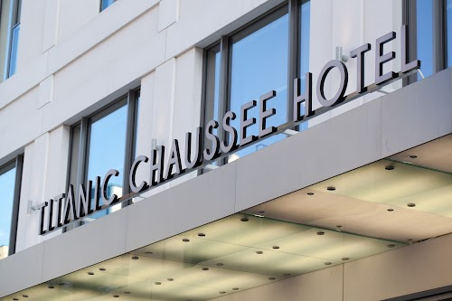

ImageAuthor: _Titanic Chausse Berlin_ 

The guide says: "*Sleek property offering an Italian restaurant & an art deco bar, plus a spa & an indoor pool.*"

Original Review Source

Very much enjoyed spending time in this hotel. The gym is large and has modern equipment. They offer an amazing business lunch! I went for the salmon pasta. Cooked to perfection and very good value. I would recommend this hotel if you are visiting Berlin. 

You write about it in your journal:

>Journal Entry: 		Managed to book a room at this sumptuous hotel; even amid my frantic search, I didn't want to skimp on comfort. Checked into their impressive gym - size of a small aircraft hanger showcasing a band of gleaming, sophisticated machines. Perspiration specks covered my forehead as I set about my calisthenics routine, every sleeve-glistening motion bombarding the doorman’s incongruities from my cerebrum> Vendor descriptors, mystery person details; everything puzzle like falling into perfect shape. 		An appetite worthy of a famished grizzly bear led me to their in-house restaurant. Enticed by their business lunch offering - if coordinating my missing-person hunt isn’t serious business, I’m not sure what is. Sampling the salmon pasta dish was akin to chucking my taste buds straight into culinary heaven. Fresh, flavour-packed ribbons of pasta, luxuriating around perfectly seared fish morsels that practically melted upon the first eager bite. Amidst the swirl of titillating gastronomy, though, intrigue gnawed at the edge of my consciousness. The waiter had a nervous twitching pallor; he mirrored the description of an important lead - tells falling right in place like tumblers in a heist-vault lock. My missing person search had just taken on mouthwatering layers with a patented Berlin twist. Each tasty morsel hilariously echoing my motto; 'Adventures always turn out to be deliciously unexpected.'

You shrug and leave a 5 review.

Your post on Facebook says:

>*Had an amazing day at the hotel. 💪 The gym is huge and has all the latest equipment.*

You post a random snap of the sights to make your friends jealous:
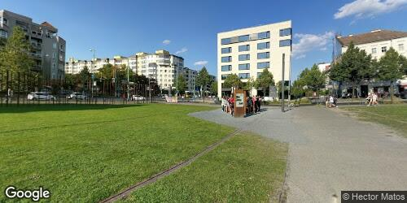

***

As you wander through the streets of Berlin, the gray and ominous clouds above match the heaviness in your heart. The bleakness of the weather seems to amplify your mood, and you find yourself yearning for some semblance of joy. The bustling city around you is alive with the sounds of hurried footsteps, car engines, and distant conversations in a language that is foreign to your ears. The smell of freshly brewed coffee wafts from the nearby cafes, and you can't help but long for a comforting cup to warm your soul. Despite your low spirits, an idea begins to form in your mind. Perhaps seeking solace in the city's vibrant art scene will distract you from your search for the missing person. The art galleries, with their colorful and eclectic displays, might just hold the key to lifting your spirits.

So you decide to spend a few hours here: _Berlin Wall Memorial_ 

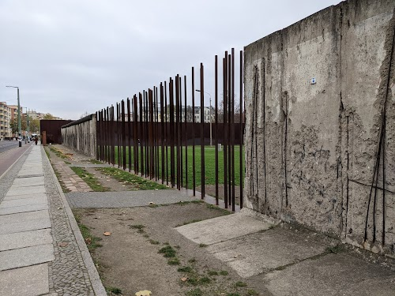

ImageAuthor: _Joana Matos_ 

The guide says: "*Commemorative stretch of the historic divide with a preserved section of original wall & memorial.*"

Original Review Source

This seems like a very accurate recreation of how the wall existed in its original form. With memorials for the fallen trying to cross, explanations of how the ‘kill zone’ worked and existed. Various stories of hearbreaking separation and tactics to stop eastern Berliners from escaping to the west. The Reconciliation sculpture is beautiful. 

You write about it in your journal:

>Diary Entry:		Today was an incredibly informative and, quite honestly, emotionally taxing day, visiting what once was the Berlin Wall. Seeing it in such an accurate state to its original form was chilling it its realism, each stone reeking of tales of division and despair. As I walked along the preserved remnants, I stared at memorials dedicated to the brave souls who dared challenge the status quo and fell whilst trying to cross this divide. It's heartbreaking to decipher not their names engraved in these memorials but also the implications. How desperate a situation necessitates such a perilous escape attempt?		Reading about the meticulously explained 'kill zone' made my heart heavy as cold hard trivia unfolded the ruthless monument's intent- discussing how it existed and how brutally effective it was to deter any hope of freedom. It's bizarre to, on one hand, appreciate the lengths controllers went to preserve border integrity whilst on the other question the moralities leading to such actions. 		The stories that captivated me most were those of horrific separation and the astounding ingenuity behind the tactics used by eastern Berliners- challenging odds with astoundinlgly creative methods that were emblematic of their struggle, their desire for freedom as they tried escaping into West Berlin. I couldn't help but think about the person I'm looking for. Could they have been part of a similar narrative? Only time will tell.		Finally, a ray of hope was the Reconciliation sculpture- subtle yet significant. It emits an aura of forgiveness and unity in the same space where animosity and division once ran rampant. I hope my search ends here as well- in reconciliation, in silent apology and reunification. Tomorrow paints another day.

You shrug and leave a 5 review.

Your post on Facebook says:

>*At the Berlin Wall Memorial today.*

You get a bite here: _Rüyam Gemüse Kebab 2_ 

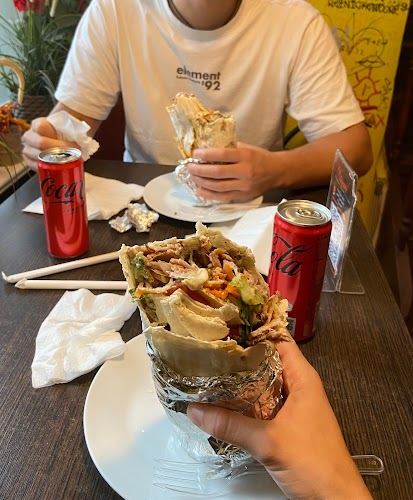

ImageAuthor: _Gloria Cassin_ 

Original Review Source

The best kebab place in Berlin. Though I have couple of favorites I would pick this as the best because of the unfailing taste standards this place offers everytime I visited them. Portion sizes are generous They give you free tea. Food is prepared just before your eyes and you can see the freshness of the ingredients. Lot of seats available Prices are moderate and affordable. Be prepared to wait in long lines but let me tell you it's worth it! 

You write about it in your journal:

>Diary Entry:		There I was, wandering the bustling streets of Berlin, my search for the missing person leading me down every unknown alley and nook. As fate would have it, in the belly of the city, I stumbled upon the most unassuming kebab spot. It faintly promised a taste of home and comfort, so I decided to give it a shot. 		Oh boy, rarely have I seen such a harmonious amalgamation of authenticity and sheer culinary brilliance! There was something fascinating about watching each portion meticulously prepared in front of one's very eyes, a tableau of a dance between the robust spices and the freshest of ingredients. The wholesome portions managed to bridge the dichotomy between deft indulgence and satiating wholesomeness.		An added treat lay in the form of generous servings of free tea that accompanied the meal. Were they subtly attempting to synthesize that potent hospitality narrative that somehow touched a nerve? Probably. Amidst all this, an unsolicited thick line of hungry consumers battling the Berlin chill was a spectacle — a testament to the respect this hub held amidst people's hearts.		Calculably priced goodies yielded an undefined, elevated state of solace-created satisfaction in me. Furthermore, even at the apex of rush, empty cozy seats welcomed many like me - weary souls pulsating through Berlin’s arteries to find a place of warmth. 		There remained an air of bustling simpleness awash the venue as I weighed in the milieu against my purpose: searching for an individual who seemingly vanished into thin air. My meal was a delicious pause, a break in my comprehensive search. Regardless of my fundamental mission, this curious dining episode was an unexpected delight midst apprehension that stood as a silent reminder - life always finds a way to serve unexpected love onto one's plate when most needed.

You rate it a 5.

Your post on Facebook says:

>*The best kebab place in Berlin  🥙🔥*

You post a random snap of the sights to make your friends jealous:
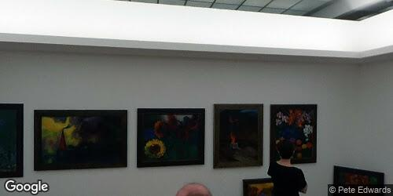

***

As you walk through the streets of Berlin, raindrops pelt against your umbrella, matching the rhythm of your restless thoughts. The bustling city seems to hibernate under the gray clouds, with people scurrying hastily, trying to avoid getting wet. The distant sound of car horns blends with the pitter-patter of rain on the pavement, amplifying your unease. You can't help but wonder if the missing person sought shelter like the others or if they ventured out into the downpour in their infinite wanderlust. Searching feels like an uphill battle, but perhaps this gloomy weather could be an opportunity - a chance to explore the hidden corners of abandoned cafes and tucked-away bookstores where forgotten souls might seek solace on a rainy day.  With renewed determination, you take a deep breath and plunge into the labyrinthine streets, hoping that the beat of the city will lead you one step closer to finding the clues you seek.

So you decide to spend a few hours here: _Hamburger Bahnhof – Nationalgalerie der Gegenwart_ 

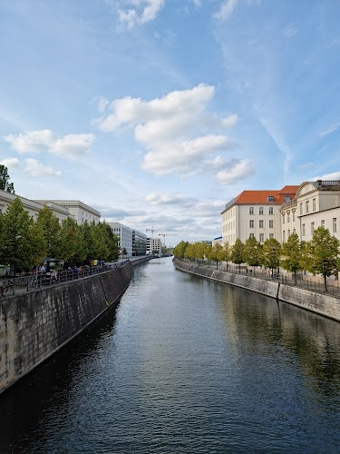

ImageAuthor: _Алексей Быцанев_ 

The guide says: "*An art museum in a former 19th-century railway station, showing works from 1960 to the present.*"

Original Review Source

Interesting place. Its a former train station remodeled into a museum. There are collections and special exhibitions. The modern art collection is focused on German artists and Berlin. 

You write about it in your journal:

>Dear Diary,		Walking almost aimlessly through the beautiful city of Berlin, I found myself drawn towards a certain uniqueness, a structure that elicited intrigue. Swathes of people were quickly swallowed in, and I followed suit. Stepping through the threshold, a realization washed over me: this was no commonplace building - it was a relic of the past transmuted into a custodian of modern art. Its former life as a bustling train station had been skillfully retained in its rejuvenated form, the echoes of chugging locomotives and bustling crowds almost palpable amidst the hushed murmur of appreciative visitors. To say this experience was surreal would certainly be an understatement.		My eyes were treated to an aesthetically rich banquet as I traversed room after room boasting myriad art collections and remarkable special exhibitions. They seemed to whisper stories in dialects unfamiliar, yet overwhelmingly captivating, drawing me into their world. But there was something intrinsically Berlinesque about the entire ambience that bound everything together in Gordian knots of indescribable symphony, piercing the veil of art appreciation to delve into immersive storytelling.		The modern art collection held an esoteric place in the grand design, almost illuminating the path my investigation needed to take - through Berlin, through German artistry, through deeply etched cultural imprints. The color palettes, mediums and stylistic interpretations seared unforgettable brush strokes into my mind, inspiring thoughtfulness and steadfast resolve alike.		I left that day feeling curiously more attached to my mission; a connection forged through a profound bridge of artwork and architecture that spanned across epochs. Seemingly closer to the soul who'd slipped inexplicably off the grid. Through art then, seemed not only a representation of spirit but also a compass guiding toward mysteries yet unsolved...

You shrug and leave a 5 review.

Your post on Facebook says:

>*At the coolest museum today! 🏤🎨 It's an old train station that's been turned into a museum with a bunch of cool collections and special exhibitions, including a modern art collection focused on German artists 🇩🇪 and Berlin 🌃🖌️ #art #history #culture #Berlin*

## Day 2

You're running low on money. Changing it up a bit...

Tonight you'll be sleeping here: _The Circus Hostel_ 

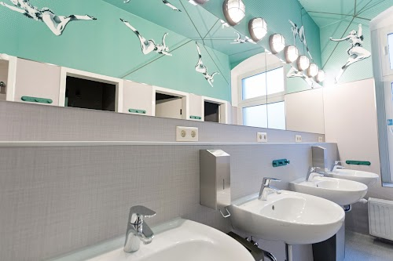

ImageAuthor: _The Circus Hostel_ 

The guide says: "*Eclectic dorms, rooms & apartments in a colorful hostel with dining, a brewery & outdoor seating.*"

Original Review Source

This is a really cool, really fun, well located, clean, social and private hostel. Everything you need when you visit Berlin. The events they put on and the tours the host make it easy to make friends. The bartender down in the basement bar/library, Laura, is amazing. She is creative, attentive, fast but deliberate, super nice and just truly one of the best bartenders I’ve seen in Germany, maybe all of Europe. Truly a stand out of my whole trip to Berlin. Giver her a raise!! 5 stars to the hostel, 6 stars to Laura!!! 

You write about it in your journal:

>Diary Entry: Wandering the cobbled streets of Berlin on my intense personal quest, I stumbled upon a remarkable piece of my puzzle at an often overlooked gem of a location - a blissful mix of social hubbub and serene solitude, an unassuming hostel. Its vivacious character known only to those who dared close enough to experience. 		The memories from the events held there etch deeper than I ever expected, peeling back layers to shards of unpredicted truth. I was granted life-long friendships I hadn't anticipated; bonds forged amidst tours anchored by the vibrant stories pulsating from the core of Berlin.		Within its comfortable walls, I found more than just clues, but a comfortable hub tingling with nostalgia and novelty. Its cleanliness limiting to the chaos that soothed my single-minded focus. Literally under wraps was an eccentric touch - a bar, tinged with intoxicating obscure narratives. Housed in a room that echoed with whispers of myriad drunk tales, challenging minds lost in drunken reveries and spinning out threads I didn't know I needed. 		My odyssey became as intoxicating as the aged, dimly lit library books lining the paneled walls of the basement bar. Beside these volumes of missed history stood Laura, the epitome of dedication college-aged bartender. Colleague becomes confidante on my nocturnal exploits, as Laura listened with quiet intrigue and empathy towards my unvoiced loneliness. 		Sure and swift in her grace, always ready to challenge the stagnancy with her artful pour, she became my compass in many ways. A voice in the crowd, grounding me back to my purpose's root among the city's faceless press. If hostel walls could talk, they would surely match their voices in praise for her akin to the hidden stories unfolding under a seemingly ordinary life out on her bar. Balancing reinventing cocktails and keen observation, she proved to be pivotal - a main link in my search.		Looking back, Laura was my Berlin, capturing its spirit of unrest, fragments of stories, and at the heart of it, incomparable warmth awaiting the solitary traveler. Standing out like stark notes in the symphony of a daunting city singing odes of history to me, she stitched moments bright as stars into my gridlocked pursuit for answers. It was a delightful twist in my narrative - a happy mischief in the mundane. Tomorrow brings new streets to pace, new faces to study, but today, Laura's humanity has lingered; another clue unnoticed yet cardinal.

You consider this a 5 star visit.

Your post on Facebook says:

>*Such a cool, fun, and social hostel in Berlin!*

You post a random snap of the sights to make your friends jealous:
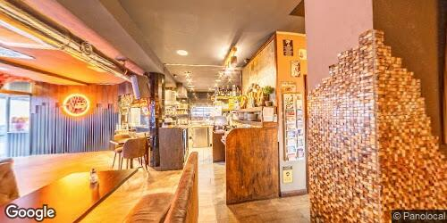

***

As you walk the streets of Berlin, the gray clouds above reflect your somber mood. The sound of passing cars mixes with the gentle drops of rain falling on the pavement. The city seems to be moving at a faster pace than you, with people rushing by, umbrellas in hand. Your thoughts wander, imagining where the missing person could be. Should you visit their favorite café, hoping to find some clue or familiar face? Or perhaps wander through the city's parks, wondering if they sought solace among the trees? The possibilities feel endless and overwhelming, but you push forward determined to bring them back home.

So you decide to spend a few hours here: _Checkpoint Charlie_ 

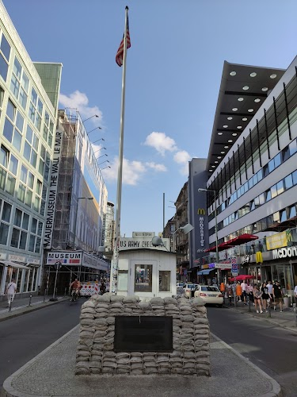

ImageAuthor: _Andreas Ungemach_ 

The guide says: "*Landmark boundary marking east & west Berlin with a white sentry guard house & cobbled border line.*"

Original Review Source

An iconic part of Berlin's history- very busy area with tourists so may need to wait to get photo taken at the hut. Lots of information boards around the area and photos from before the fall of the wall. Lots of touristy souvenir shops in area and the Checkpoint  hsrlie Museum ( very worth a visit!) 

You write about it in your journal:

>Dear Diary,		A hectic day it's been, indeed. As I ventured forth on my quest at Checkpoint Charlie, hope was stirred but tinged with despair. The cramped area was teeming with tourists eager to capture a snapshot of history in the confines of their digital eyes. The once intimidating and exclusive military post now but a constant flood of flashes and fingers pointing.		In-between taking in the story-laden atmosphere and delicately weaving my way through the masses, I grew cognizant of an array of information boards emerging here and there like frolicking mushrooms after the rainfall. Each highlighted remnants from a seemingly impenetrable barricade that sliced heart of Berlin apart, vivid photographs from pre-fall era narrating the tale of resilience and courage.		At one point, adrift in this sea of coughs, muffled conversations, and stuttering languages, I found myself stumbling upon a multitude of souvenir shops idly nestled like calm islets. Various relics from ephemeral time encased within became temporary distractions from my solitary journey.		The promise of Checkpoint Charlie Museum ushered me inside its concrete womb, shrouded by artifacts whispering the palliative lullaby of freedom. An enigma folded inconspicuously in every item inside gave me a glean of hope about the person I was so desperately trying to locate.		Yet among all these ervan whirlwinds, one singular question still hovers: will he who I seek be found in this temporal rift tomorrow or will I chase phantoms anew?	

You shrug and leave a 5 review.

Your post on Facebook says:

>*At the Berlin Wall Checkpoint Charlie today! 🇩🇪 So much history here. The area was packed with tourists, but it was still an amazing experience!  🤓🤓🤓 #Berlin #CheckpointCharlie #History #Travel #Sightseeing*

You get a bite here: _Mustafa's Gemüse Kebap_ 

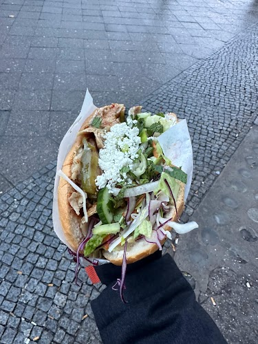

ImageAuthor: _Rayan Alyusufi_ 

The guide says: "*Popular, hearty chicken kebabs with grilled veggies, doled out from a tiny kiosk.*"

Original Review Source

You will queue. Just accept that you'll be waiting a long time. The food was great however, but I'm not sure if the almost 2 hours queue was the reason and would anything taste as good. I'm not sure I would wait another 2 hours but definitely worth it for a novel experience and a great meal. I tried very hard to find something about the food I didn't like to try to justify being annoyed about the wait.. but I couldn't. I loved every bit of the food, the crispy outside of the bread and soft inside, the amount of sauce, the veg, the meat. It was all incredible. Give it a try, if only once 

You write about it in your journal:

>Diary Entry:		Wandering in the labyrinthine Berlin streets in my relentless pursuit of the missing entity, desultory encounters with intriguing kiosks lined up in the avenue led to a serendipitous happening. I stumbled upon a bustling corner restaurant shimmering alluringly under the spectre of Berlin's capricious climate. Alas! The place was teeming with a multitude of patient patrons. Resigned, I chose to endure, let's just say, a seemingly perpetual queue under the melancholic grey sky.		The agonizing wait stretched nearly two solid hours, a distraction I could ill afford. But the beauty of the unplanned is what unfolded next. A warm meal melted my impatience away as I was hit in hindsight. Would exhaustion be the secret ingredient making ordinary taste extraordinary?		Transitioning from abhorrence of the delay to relishing every morsel was a quasi-mystic experience. The succulent meats covered delicately in enticing sauce, the crunchy compliment of vegetables and the wonderful dichotomy of crusty bread housing layers of soft crumb left an indelible mark on my culinary memory. The weary anticipation palimpsesting itself into an unexpected highpoint en route my hunt for the elusive disappearing individual. Hence continued my quest, refreshed and unexpectedly satiated by this very Berlin of pauses I took.

You shrug and leave a 4 review.

Your post on Facebook says:

>*2 hour wait but it was worth every minute!  The food was incredible - crispy on the outside, soft on the inside, with the perfect amount of sauce, veg and meat.  If you're looking for a novel experience and a great meal, give it a try! 🌟 #foodie #foodporn #nomnomnom*

You post a random snap of the sights to make your friends jealous:
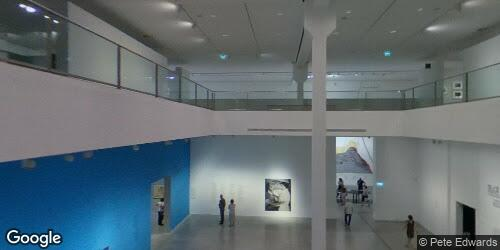

***

As you wander through the snow-covered streets of Berlin, your footsteps muffled by the fresh powder, you can't help but feel a mix of anticipation and weariness. The snowy flakes twirl in the chilly air, reminding you of the swirling thoughts in your mind. In the distance, you hear the distant chattering of happy tourists, seemingly unaffected by the heavy snowfall. Your eyes scan the crowded streets, searching for any sign or clue that might lead you closer to finding the missing person. A small cafe catches your attention, its cozy interior glowing warmly against the stark white landscape outside. You pause for a moment, tempted by the thought of warming your hands around a steaming cup of hot chocolate and pouring over old photographs, hoping to spark memories and uncover hidden clues. The cafe seems like a refuge from the cold and an oasis of possibilities, captivating your attention in the midst of your mission.

So you decide to spend a few hours here: _Berlinische Galerie_ 

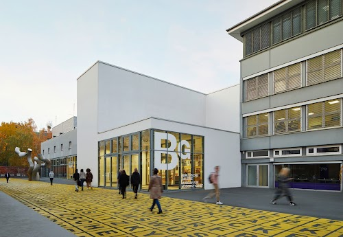

ImageAuthor: _Berlinische Galerie_ 

The guide says: "*Modern museum for fine art, photography & architecture created in Berlin from 1870 to the present.*"

Original Review Source

In the neighborhood of Kreuzberg, few hundred meters from the well known Jewish museum, this art gallery offers an extraordinary permanent exhibition and very interesting temporary ones. I went for the Munch exhibition, which was truly interesting and moving. The space is very welcoming and the people friendly. 

You write about it in your journal:

>Diary Entry: Today, my quest led me to the streets of Kreuzberg, where little rows of art burst beyond the brick walls of a cosy art gallery. Despite the immense gravity of my cause, I found myself swaying off the trail momentarily, into this captivating place located a stone's throw away from the hauntingly beautiful Jewish museum. The gallery housed an exquisite permanent exhibition that invited me into a mesmerizing dance with art.		An unexpected detour, however, presented itself in the form of their latest temporary exhibit. Oh, what a Munch! Exploring the depths of this stirring collection, their intense emotionality seemed to mirror my own desperate feelings. These works, ingeniously arranged in inviting rows, were far more than mere splatterings of paint and canvas - they were narratives. I felt a pull, a connection; vibrant hues whispering secrets and crystallised echoes of my own suppressed fears in eerie mirroring came faces.		The gallery attendants matched the warmth this space oozed - their friendly demeanor melting away my status as an outsider, lost in an unfamiliar city. Could such affable folks hold any clue about the person I was seeking here in Berlin? Each encounter, each diversion added another layer to my sojourn here. Even under circumstances as tantalisingly mysterious as these, the city wrapped its stories around me like a perpetual waltz; haunting yet enticing, desperate yet beautiful.

You consider this a 5 star visit.

Your post on Facebook says:

>*At the Munch exhibition in Kreuzberg today! It was truly interesting and moving, and the space is so welcoming  🖼️🎨🎭  #art #Berlin #Kreuzberg #Munch*

### Heading Home!

As you trod along the streets of Berlin on your relentless pursuit, the city unfolded its unique amalgamation of history, culture and nightlife before your eyes. You started your journey at Titanic Chausse Berlin, where modernity is epitomized in an extraordinary steel and glass architectural masterpiece. Inside, every corner seemed like a striking reminiscence of a bygone era with contemporary liberties- but felt cold and impersonal. This only echoed in the back of your mind as a chilling reminder of the person you were searching for.

Next, you visited the Berlin Wall Memorial, a place where pain and chagrin dwelled in every centimeter of its remnants. Sprayed with hues of history, displaying vivid stories throughout its length, it evoked a flood of thoughts, relating to the individual you seek who too had stories, secrets tucked away.

An unexpected culinary excursion camouflaged the heaviness in your heart. You visited Rüyam Gemüse Kebab 2 and Mustafa's Gemüse Kebap - kebab shops known for their sizzling grills offering an impressive amalgamation of taste and texture. Yet, even though the city's savor danced on your tastebuds, it couldn't uplift your spirits entirely.

Thereafter, you took rounds at Hamburger Bahnhof – Nationalgalerie der Gegenwart and Berlinische Galerie – cathedrals of modern art. Regardless of the variety they offered -from surreal to abstract art that stood short of nothing but brilliance - you couldn't really relish their beauty as your mind was tied with strings of concern.

Your concerns amplified when visiting Checkpoint Charlie, the pivotal point which separated the East from the West during the woeful years, being a stark reminder of isolation and desperation.

The Circus Hostel showcased a completely different vibe– full of energy and youthfulness. In contrast to all the historical gloom that you had been through, the vibrant hues and lively corridors felt almost uneasy, constantly reminding you of the person who was lost.

Your visit to the Berliner Fernsehturm saw an elevation not just in height but also stress. The highest peak of Berlin brought along an undeniable realization that your search was not yet over.

When you reached the last destination of your trip, the Charlottenburg Palace, you felt an anticipated unease. Designed to awe with every grandeur detail, all you could see in its immense spread were countless more hiding spots for your person to be impulsively lost within.

As you conclude the search day after visiting these remarkable landmarks in Berlin, with deep regret and a heavy-heart. You realize that even though you have experienced so much of what Berlin has to offer, the trip remains clouded with impending failure so far. Managing to appreciate elements and yet simultaneously being incapacitated by worry, has proven to be a burden so heavy as to drain you emotionally as your search continues.

Of all the snaps you took, these were your favs:

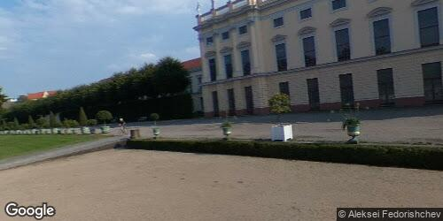

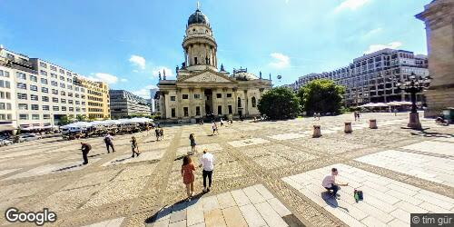

