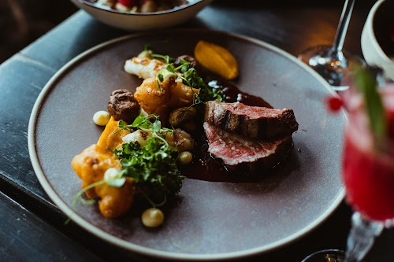
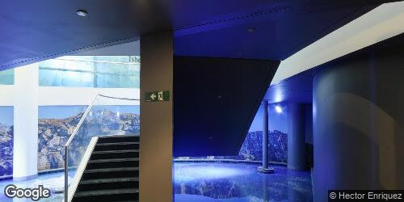

## Diary of a (Google Maps) Trip to Rekyavik, Iceland

You've come to Rekyavik, Iceland on vacation alone, and you're here to look for and catalog local fairies. You're planning to visit the city's many parks and green spaces, like  Hljómskálagarður Park and  Grótta Nature Reserve, where fairies are said to dwell. You also plan on visiting the  National Museum of Iceland, which has a collection of artifacts related to Icelandic folklore and mythology, including fairies. Finally, you're going to talk to locals and ask them about their experiences with fairies.

## Day 1

Tonight you'll be sleeping here: _Reykjavík Marina - Berjaya Iceland Hotels_ 

ImageAuthor: _Reykjavík Marina - Berjaya Iceland Hotels_ 

The guide says: "*Quirky quarters in a stone-built hotel with a restaurant & a bar, plus a gym & live entertainment.*"

Original Review Source

I always enjoy this hotel and my wife and I have stayed here both times in Reykjavik. But visitors need to understand a few things: - Each room is unique and you likely won’t get a room similar to any photo you see. Expect variability. - Some of the bathrooms in the less expensive rooms are frosted glass without a door that closes so if privacy is a concern, upgrade your room. - It sits next to a maintenance dry dock for commercial ships. So, it won’t be quiet during the day…but you do get a fascinating view of major repair projects for huge marine vessels. 

You write about it in your journal:

>Diary Entry:		What a fascinating day I've had staying in Reykjavik's uniquely eclectic hotel! Every room here seems like its own tiny world, so different and unexpected. My shutterbug senses sprung to life the moment I entered my new abode for the night - an unanticipated home far from home, nothing even close to the promotional photos, and yet, inspiring immense delight with its unpredictable novelty.		Oh, and talk about an intimate twist, the bathroom was an unexpected showstopper - a walled construct of frosted glass with no semblance of a door to close. Sent a few waves of unease considering my privacy concerns. But then again, isn't that a part of this fairy-hunting adventure - pushing boundaries and redefining comfort zones? 		As daylight crept in, an unexpected symphony began its gentle hum. The rigging roars and mechanic hums from the neighboring maintenance dry dock for commercial ships served as an unusual morning alarm instead of traditional bird chirps or buzzing background city noise. It wasn't exactly the serene morning calm I'm used to, but instead, presented a front-row seat to a galore of lively action - the disassembly, repair, and construction of massive seafaring beasts. Transmitting an unbelievably unique charm to this getaway, animating my day with this detailed exploration of industrial crescendos.

You shrug and leave a 5 review.

Your post on Facebook says:

>*Just another day in paradise at the coolest hotel in Reykjavik!*

You post a random snap of the sights to make your friends jealous:

***

As the morning sun blankets the streets of Reykjavik with its golden glow, a sense of wanderlust tugs at your heart. You can't help but feel a mix of excitement and gloom as you walk amidst the hustle and bustle of the city. Laughter and chatter fill the air, mingling with the occasional cry of seagulls above. Though the vibrant energy of Reykjavik is all around you, it does little to lift your somber mood. Lost in your thoughts, you yearn for the company of fairies, hoping they may bring a touch of magic to your day. With the captivating weather inviting you to explore, a glimmer of hope sparks within you - it's time to venture out and search for these elusive creatures amidst the hidden corners and hidden paths of this Icelandic gem.

So you decide to spend a few hours here: _Nordic House_ 

ImageAuthor: _Norræna húsið_ 

The guide says: "*Nordic cultural center with modern design for exhibits & events, plus a library, shop & restaurant.*"

Original Review Source

Mango and coconut cake w/ cream, it was moist inside with crunchy edges, a bit of baked coconut provided the crispy texture, the sourness of the mango sauce adorned the whole cake. The cake tasted super healthy, mostly because it is not sweet as normal cake, no mention it is far below the Icelandic sweetness level (Good because I don’t miss my dentist). Then we ordered Herbal Oat Lattes, excellent as usual. We had Rose coco and lavender, both smell & taste natural, because they put debris and powder made by real dried flowers. It was a quiet sunday afternoon, with the still pound view☺️ Cold air and calm day~ 

You write about it in your journal:

>Diary Entry:  		What an adventure today in Reykjavik had in store for me! It baffles me how my pursuit to catalog local fairies can somehow lead me to culinary treasures as well. I fancied a succulent Mango and coconut cake today, rich and moist on the inside but with delectably crunchy edges. There was a clever twist of baked coconut that provided that unexpected crispness, while the tangy ponderings of mango sauce amplified the tropical allure of the dish.		I couldn't help but marvel at its health-inspired composition - not nearly as sweet as your conventional cake, let alone ring even remotely close to familiar Icelandic puddings. I chuckled, 'Seems like these fairies have given my sweet tooth a vacation as well. Well, my dentist would be proud!'		Needing a sip of exquisite warmth, I ordered a Herbal Oat Latte, specifically the Rose coco and lavender kinds. Taking that first sip was like embarking upon a sensory voyage! The myriad scents unfurled in my nostrils lining up perfectly with their mesmerizing tastes – no wonder they mastered their notes so convincingly, they use real dried flowers after all - powdered to perfection!		Seated there that quiet Sunday afternoon, amid the stunning view of the still waters reflecting the beautiful city, I couldn't help but admire how my day meandered. Armouring myself against the biting cold, its calming presence complimenting perfectly with the tranquility around only persuaded me to continue my delightful fairy-seeking journey in this fascinating city.

In any case, you leave them a 5 rating.

Your post on Facebook says:

>*Mango coconut cake with cream - moist inside with crunchy edges. Baked coconut adds a crispy texture and sour mango sauce adorns the cake. Not too sweet, so it tastes super healthy. Paired it with an herbal oat latte - Rose coco and lavender, both smell and taste natural. The debris and powder are made with real dried flowers. Quiet Sunday afternoon with a still pound view and cold air ❄️😌☕️🍰☀️*

You get a bite here: _Grillmarkaðurinn_ 

ImageAuthor: _Valerio Villani_ 

Original Review Source

Incredible! The tasting menu was spectacular.  The arctic char, shark and lamb were our favorite non-dessert items. The whole dessert platter was great!  Definitely make reservations in advance. 

You write about it in your journal:

>Diary Entry: Today, in the heart of the camaraderie of colder climes, I had the unique experience where my taste buds seized onto an unexpectedly diverse array of flavours, part and parcels of a specially curated tasting menu. I started off with a tantalizing portion of Arctic Char, its natural sweetness a pleasant surprise for my palate. The decadence continued when I sampled a bite of their shark dish - an audacious move for my usually timid taste preferences, and yet it held a savouriness I never knew I could appreciate! It was followed by a taste of local, rich lamb which had me reveling in its slow cooked juiciness, a grand show for the carnivore in me. And then there was an entire platter dedicated solely to desserts! It was like welcoming Heaven on earth with each glorious bite I took. Dessert began playing a whole new symphony! How astoundingly typical of my adventure seeking self to not allow pre-booking a table and yet the stars aligned, facilitating a culinary exploration I never thought possible! Goodnight.	

You consider this a 5 star visit.

Your post on Facebook says:

>*Arctic char,🦈, and lamb were highlights of the incredible tasting menu we had tonight!  The dessert platter was great too! 👍🏼😋 Make reservations in advance at this popular spot!*

You post a random snap of the sights to make your friends jealous:

***

As you walk through the dreary streets of Reykjavik, the heavy clouds above seem to match the weight on your shoulders. Despite your low mood, the city is bustling with activity. Tourists and locals alike fill the sidewalks, their jackets pulled tightly around them to fight off the chilly air. The faint sound of laughter and conversation drifts through the air, reminding you of the vibrant social life that thrives here. You can't help but wonder if the fairies you seek are hiding among the crowds, unseen by human eyes. Perhaps, instead of letting the weather dampen your spirits, you could embrace it and explore the mystical corners of Reykjavik, searching for traces of fairy magic in the nooks and crannies of this enchanting city.

So you decide to spend a few hours here: _Whales of Iceland_ 

ImageAuthor: _Whales of Iceland_ 

The guide says: "*Educational exhibit dedicated to regional whales, with life-sized models & interactive features.*"

Original Review Source

You get free entry when you do a whale watching tour. I was going to skip it but I'm really glad I took advantage of the free entry! The audio guide is great and the displays are honestly really fun to see. It helps a lot to put the size of the whales in perspective, especially after seeing just a small fin poking up out of the water. Staff were nice at the facility, it was clean, and the gift shop had great stuff for kids. 

You write about it in your journal:

>Dear Diary,	 	My day was an unexpected delight. Since I was so close, I decided to explore the local whale watching tour. It was almost a magical surprise when they told me, after the icy waves and wonderful sights of those magnificent creatures from afar, that I had been granted free entry into an unseen world. 	I didn't think much of it at first, planning to bypass it due to my fairy mission, but something piqued my interest, and goodness, am I thrilled that I gave into that curiosity! With an audio guide resonating in the background, I meandered through exhibit after exhibit that was both educational and fun. I saw models and visual displays that brought the colossal size of these marine giants into perspective; it was a stark comparison to merely seeing a small fin poking out of the water earlier in the day. I mused over how even in our world's reality, there were creatures as magnificent and mysterious as the fairies I seek.  	The staff at the facility added to the pleasant vibe with their warm manners and amicable behavior. Also noteworthy was the pristine cleanliness of the entire place – what stood out was no overcrowded trash bins or smudgy windows interrupting the incredible views. Shortly before leaving, I couldn't resist peering into the gift shop brimming with fascinating trinkets - though the children's toys held no interest or relevance for me, an artisan-crafted whale pendant caught my eye. It's now a lovely reminder of my shared world with fairies and whales alike.	

You rate it a 5.

Your post on Facebook says:

>*Free entry whale watching tour: 10/10! 🐳🌊😍 The audio guide was great and the displays were fun to see. It really puts the size of the whales in perspective. Staff was nice, the facility was clean and the gift shop had great stuff for kids! 👍 #whalewatching #marinelife #oceanlife*

## Day 2

You're running low on money. Changing it up a bit...

Tonight you'll be sleeping here: _Hostel B47_ 

ImageAuthor: _Piotr Biedacha_ 

The guide says: "*Vibrant hostel with 24-hour access, communal living areas & a kitchenette, plus a heated patio.*"

Original Review Source

5 star for everything! Very safe place to stay. They have codes to enter the building and rooms instead of keys. I liked that. Staff are very helpful and welcoming. Rooms are spacious, clean bed, duvet, pillow and towels. Washroom and shower place are very clean and well maintained. Dining area and kitchen are well equipped.  They have extra space to keep you luggage in case you arrive early. Localisation unbeatable! Close to most popular attractions! 

You write about it in your journal:

>Diary Entry:		Following my search for the elusive Icelandic fairies, I found myself at an intriguing shelter right smack in the heart of Reykjavik. The symmetry within this building intrigued me - coded locks protecting the interior, a distinct nod to modern secure systems instead of dated keys. The people examining over the vast confinements were an amalgamation of gracious and informative folks – they made me feel right at home albeit my unusual quest. 		The room I occupied was extensively spacious, generous even – especially when compared to European standards. Every piece in the space - from the clean bed to the duvet, even the plush pillow and preened towels were all tidily kept to make me feel welcomed. The washroom mirrored a similar ambiance, expertly cleaned and maintained leaving me with a sense of serenity and peace as I took my mountainous hot showers every evening.		The welcoming communal kitchen teemed with more provisions than I could comprehend. It was as if it was equipped keeping in mind every characteristic dish conceivable reinforcing this stretched-out sense of shared camaraderie. Their consideration extended to those arriving early as they provided an ample area for guests to store their luggage.		I felt a rather pleasant convenience to be able to strut off my dwelling, virtually landing onto most of the popular local attractions in town. My never-ending exploration and cataloging of local fairies took an exciting turn when I started discovering them in places I least expected. Reykjavik embraced this unusual mission of mine with warmth that outmatched the local geothermal springs, even without understanding it.	

You shrug and leave a 5 review.

Your post on Facebook says:

>*5 star for everything! ⭐️*

You post a random snap of the sights to make your friends jealous:

***

As you wander through the streets of Reykjavik, the somber mood of the cloudy morning reflects in your own state of mind. The city buzzes with activity, despite the gloomy weather. You hear the melodic sounds of Icelandic chatter, punctuated by the occasional cheerful laughter of locals. The smell of freshly brewed coffee wafts through the air, tempting you to find solace in its warm embrace. Surrounded by quaint colorful houses and charming cafes, you can't help but be reminded of the enchanting fairies awaiting your discovery. Perhaps now is the time to seek out a cozy nook in a café, sip on a comforting cup of coffee, and dive into the mystical world of Icelandic folklore.

So you decide to spend a few hours here: _Omnom Chocolate Ice Cream Shop_ 

ImageAuthor: _Kelly W_ 

Original Review Source

Super twee chocolate and fantastic soft serve ice cream. Skip buying the bars in the other stores around town and get them straight from the source. And have some ice cream while you're at it. Might be hipster. Might be influencer. Still, all delicious. 

You write about it in your journal:

>Diary Entry: 		Dear Diary, 		What a day! I ventured to the heart of Rekyavik, seeking some sugary respite from my typically earthy fairy hunt and unexpectedly discovered the crown jewel of confections. Upon entering this charming nook, I was greeted by the irresistible aroma of pure cocoa and velvety vanilla. Their chocolate! Oh dear diary, I never stood a chance. Countless bars gleamed from behind the glass counter, each one promising an unparalleled taste experience. But these weren’t just any chocolate bars you find around town, These were... ambrosial. Like they had been woven together with threads of pure delight! 		I gave into temptation headfirst and uncovering their birthright felt almost sacred. The chocolate melted on my tongue, weaving a rich tapestry of flavors so profoundly decadent, it was as if the grand composer of cocoa himself conducted an orchestra in my mouth. 		Before I could quite recover from such elation, a swirl of soft serve ice cream meandered into view. Was it destiny or whimsical trickery of my dessert-driven subconscious? Nonetheless, my resolve softened under its creamy allure, so I had a scoop—or five. There might've been a smidge of hipsterness dripping from the pristine-clean wooden decor or a dash of influencer vibes glittering off the gourmet selection of deliciousness, but either way, I was far too enthralled by these culinary manifestations of joy to overthink it. What a delightfully unexpected turn for a fairy chaser lost in Rekyavik's hidden alleys. Tomorrow couldn't possibly hold any more surprises... can it?

You rate it a 5.

Your post on Facebook says:

>*Super twee chocolate and fantastic soft serve ice cream. 🍫🍦Skip buying the bars in the other stores around town and get them straight from the source. And have some ice cream while you're at it.*

You get a bite here: _Sjávargrillið_ 

ImageAuthor: _Sjávargrillið_ 

Original Review Source

The food, the cocktails, the service.  This place is GREAT.  From bite one I was in heaven and SO glad I took the advice of our server and tried those lobster tacos.  There just seemed to be so much thought put in to every dish and the flavors were amazing.  I honestly licked the bowl that my soup came it and I feel no shame about it because letting a single drop of that go to waste would have been an insult. 

You write about it in your journal:

>Diary Entry: Today's voyage in fairy-finding led me to an accidental fairy feast. I had decided to break at this quaint, vibrant eatery I chanced upon. The spirits - the cocktail-kind, not my typical whimsy-winged pals - danced as liberating potions peculiarly tamed my roving fairy-obsessed spirit. 		My gastronomic adventure embarked with the echo of a suggestion - lobster tacos. By the Fae! Those mortal morsels of culinary delight awakened a different kind of gnome within, guiding my taste buds onto untapped vistas of flavor. Each bite was a revelation, searing my senses with delicacies far removed from my usual nourishment. 		Apprehension entwined with anticipation when the soup arrived. I confess, not a drop of decadence was permitted to flee as with a gusto brushed in unashamed enthusiasm, I found myself licking the bowl clean. Perhaps an uncouth spectacle for the mortal bystanders, but to let any part of that potion of joy fade away would have felt like belittling the mead of the Seelie Court itself. Magick or not, today's venture somewhat drifted from the wonder-chasing path but surely treated me to another realm of pleasure within the quaint braids of Reykjavik. Delightful indeed!

You rate it a 5.

Your post on Facebook says:

>*Had an amazing time at this restaurant! 🍴🍹 The food was delicious, especially the lobster tacos 🌮🔥 The service was also great! Definitely recommend it! 👍*

You post a random snap of the sights to make your friends jealous:

***

As you wander through the streets of Reykjavik, the cloudy sky casts a dim light over the city, perfectly mirroring your own subdued mood. The city is bustling with activity, but the lulls in conversation and hushed tones of passersby match your desire for solitude. You glance towards the grassy hills in the distance, hoping to catch a glimpse of a mischievous fairy fluttering amongst the wildflowers. Perhaps this gloomy weather will provide the perfect opportunity to uncover the secrets and hidden enchantments that lie within Reykjavik's nooks and crannies.

So you decide to spend a few hours here: _The Settlement Exhibition_ 

ImageAuthor: _Iñaki Ruiz_ 

The guide says: "*Remnants of 10th-century Viking settlements in Reykjavik are preserved in this interactive museum.*"

Original Review Source

Great museum. Was mostly underground (cool factor) and had a nice mix of physical exhibits, audio, and video. Definitely kept us interested. Plus it's the actual site where they found remnants of a home. So cool! Went to the National Museum the previous day and this one (in my opinion) was way more interesting! Would recommend! 

You write about it in your journal:

>Today's escapades led me to a captivating museum. It was buried mostly underground, a hidden gem of sorts, adding so much to the intrigue. The harmony between physical exhibits, audio, and video was purely refreshing. Time seemed to slip away quickly as I was engrossed in the collection that told a rich and compelling story of a frozen past. One of the highlights was the site were remnants of a home were found. I could feel the life pulsating from it, the echoes of its occupants long gone. Fascinatingly, I had ventured to the National Museum yesterday, while also captivating, what stood out about today's museum was the sheer uniqueness and depth it offered. I am eager to continue my search for local fairies here. Thoroughly exhilarating!

You consider this a 5 star visit.

Your post on Facebook says:

>*At the coolest underground museum today! 😍 It had physical exhibits, audio, and video. So interesting! It's also the site where remnants of a home were found. Definitely recommend! 👍 #museum #history #ancienthistory*

### Heading Home!

You roved across Reykjavík's breathtaking landscapes like one entranced by the beauty of a different world, just to fulfill a whimsical mission - cataloging local fairies. You embarked on this journey, encouraged by elusive myths and innocent folklore, secretly captivated by the chance that you might indeed encounter these mystical creatures. 

Your first stop was the Reykjavík Marina - Berjaya Iceland Hotels which exhibited an arresting blend between the modern and idyllic. Unfortunately, its polished glamour made it devoid of the fairy alcoves you were seeking. Next, you decided to delve into the cultural sphere at the Nordic House, being entranced by its architecture and thoroughly ingesting potential local lore conveyed through various exhibitions. 

Resigned to the chill around you, you sought warmth and nourishment. You ended up at Grillmarkaðurinn, where the culinary artistry staged there was almost fairy-like but of course, gourmand arenas were not of much assistance with your uncommon search. Captivated by magnificent sea creatures at the Whales of Iceland felt close to your fairy-seeking quest yet so far.

The National Museum of Iceland then beckoned you, its vast collection providing rich insight into Icelandic history and the local folklore throwing stimulating hints about the mystery that were fairies. With adrenaline pumping, there was a glimmer of hopes. With steps robust, you hit the warmth-less pathways toward Hostel B47 only to end up with bare tired rooms. 

The distilled gloom needed shedding off, and Omnom Chocolate Ice Cream Shop obliged heartily with mind-altering confections. But the sugar rush wore off soon, leaving room for gloominess to seep in again as all your dedicated searches seemed in vain.

Later, at Sjávargrillið, words echoing stories about fairies frequented conversations but they never materialized from the shadowy corners. The Settlement Exhibition painted deeper shades of dainty mythical portrait favoring the fairy search, sadly the exhilaration faded by unreachable realities. And when you ended your journey at Perlan, absorbing mind-staggering paranoma, breaking weak smiles at golden sun-rays touching pure snowy Reykjavik, there was much beauty but no hint of fantasies wished for.

So here you are, as your high spirits gradually drained away over fruitless pursuits, feeling low and wondering what next? You had found tales whispering of fairies and moments flirted with half-formed ethereal silhouettes, but no concrete evidence to catalog. 

You liked the magical fabric of local folklore interweaved with beguiling landscapes, yet disliked that such allure did not extend to the materialization of fairies. Would this trip stand out as an exciting chase for a mythical childhood fantasy or as a journey to grapple with the stark wall separating fiction and reality? Time would likely tell. But for now, let's say you fulfilled half the journey - the joys of seeking even when there were no prizes for finding.

Of all the snaps you took, these were your favs:

