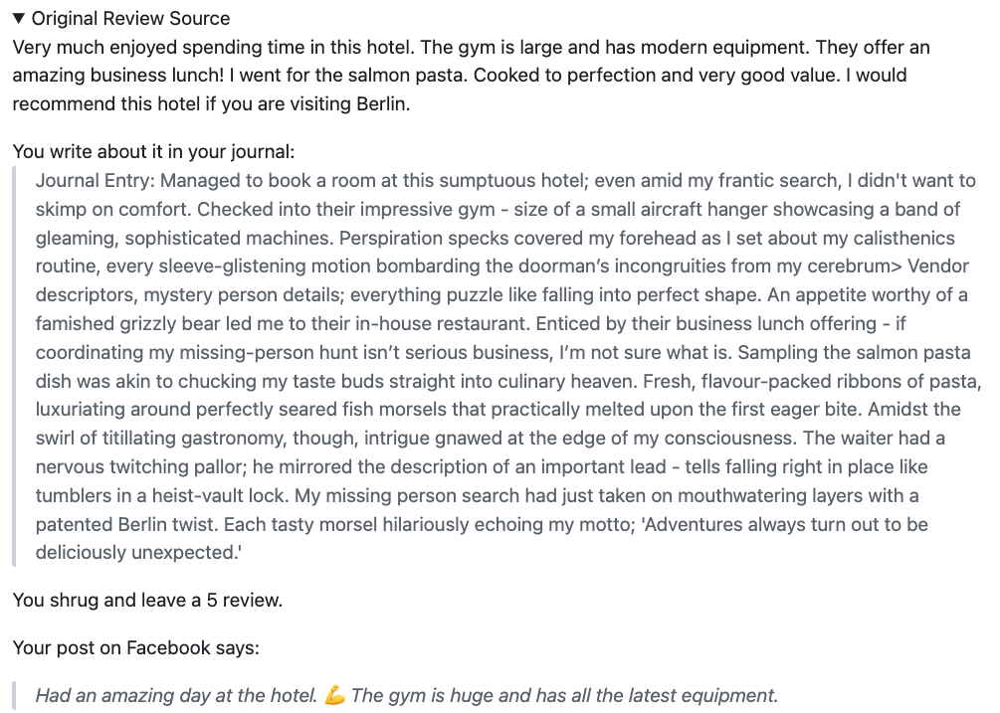

# Diary of a Virtual Trip - Using Google Maps/Places/SV & LLMs

A NaNoGenMo project using the data source of Google Maps and Places and Streetview by API, and a mix of PALM2 and GPT4/3.5 for text connectives. With randomness. [This is kind of a sequel to my NaNoGenMo project ["Directions in Venice"](https://github.com/arnicas/venice_directions_nanogenmo) a few years ago, which used tracery grammars plus text from a GPT-2 fine-tuned model and Flickr pics to give you directions in, yes, Venice.]

The basic idea is that I start with a vacation at a string location, like "London Bridge, London, England," and a value of money. The amount of money determines how long I stay there. Each day, I visit sites and restaurants, take pictures, and post in my journal and on social media about what I did/saw.  I have a randomly chosen "reason" for being there which effects the text generation.  I got personally more interested in the text output when I switched models and reasons to things I found fun (occult meetings, paranormal investigations, trade secrets...).

View a samples: 

[Barcelona, as a paranormal investigator](./Barcelona1.md) (Long, clocks in to 56K)

[Venice for an occult circle meetup](./Venice1.md) (Long.)

[Berlin, looking for a missing person -- short](./Berlin.md)  (Short. This is funny because there are a lot of kebab stops. It feels like product placement in a tv series, tbh.)

## Samples 

This bit from "Berlin" where you are looking for a missing person shows the comparative outputs on the data and the models. The "original review" of the hotel is real text from Google Places. The journal entry is generated by GPT4 which nicely incorporated details from it, plus fleshing out the storyline. All of its entries are like this, cleverly combining product placementy text with the plot. It makes it much more fun to read. I mean: "Enticed by their business lunch offering - if coordinating my missing-person hunt isn’t serious business, I’m not sure what is." And "My missing person search had just taken on mouthwatering layers with a patented Berlin twist. Each tasty morsel hilariously echoing my motto; 'Adventures always turn out to be deliciously unexpected.'"

The social media post is generated by PALM, which was told to just use the original review for a short positive FB post. I love the contrast of being on a serious mission and still posting on FB.

## Minor Mechanics

You have morale and money points.

Morale goes up or down based on quality of the review picked and a random weather change. You can have good or bad luck with a visit.  Money just goes down and is how I control where you stay and how long you can be traveling. To get 50K words, you need a lot of cash. Morale affects the story generation at various points.  Originally I had it decide your trip was over when your morale was in the toilet, but relented to get my 50K.

## Text Gen

There are a handful of text gen spots: an intro and a closing post, a review turned into diary/journal entry, a social media post based on a review which totally ignores your journal entry, and a "weather & morale" paragraph each day.

Text is generated by a combo of PALM-2 and OpenAI models. The PALM text wasn't good enough for creative tasks it was asked for in several cases, and it also produced too little text for the goal here. :) So I switched to using slower GPT4/3.5 near the end, for longer and more interesting and faithful text.

The basis of the journal entries is a business review picked randomly from the reviews on Google Places for a visited destination. This review (shown under the collapsed tab as "original source") is converted into a diary entry by GPT4. There short post for social media is written by PALM based on the review, which is meant to make your followers jealous.

## Images

Images: I use random photos of the places (with an author credit) visited, and a random static streetview pic from the closest location. The pics do more than the story, IMO. Sometimes they are hilariously bad, especially the streetview ones.  The pics are credited since they are used as-is.

## Limits and Concerns

There is no real attempt to get a narrative curve here, but there could have been. And there isn't a strong attempt to feed context back into the story generation, but that could have happened too.  Time, geez.

*AI Moral qualms*: I remain a bit conflicted about using reviews as story segment seeders like this, and deliberately didn't link to the establishments or the reviews/authors directly. I don't know if this was the right way to go. I like creating "data driven" stories, but I'm not sure about this use of this data. Is it another way of taking advantage of created content? Yes, but-? This is definitely a toy project and I didn't make a website for it, intentionally. You have to use your own API keys if you want to run it.

I may fix up the code and reconsider the credits situation after Hugo checks this off.

