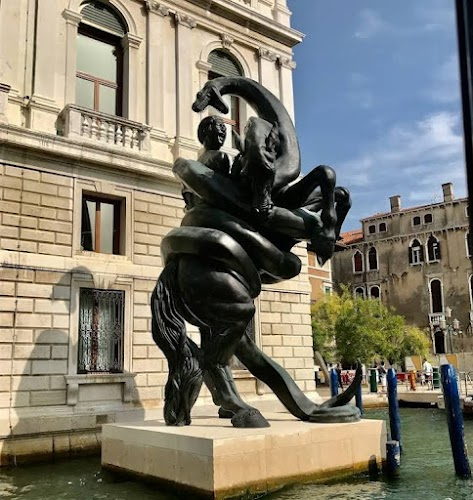
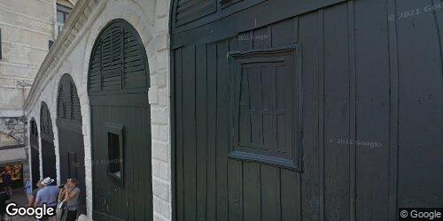

## Diary of a (Google Maps) Trip to Venice, Italy

You're in Venice, Italy, a city of canals and mystery. You're here to meet with an occult circle and you're feeling a mix of excitement and nervousness. You've been planning this trip for months, and now it's finally here. You're wondering what the other members of the circle will be like, and what you'll learn from them. You're also thinking about all the things you want to see and do in Venice: the Doge's Palace, St. Mark's Square, and the Rialto Bridge. You can't wait to explore this beautiful city and learn more about its occult history.

## Day 1

Tonight you'll be sleeping here: _Carnival Palace_ 

ImageAuthor: _Carnival Palace Hotel - Venice Collection_ 

The guide says: "*Upscale, Venetian-style hotel with canal views, as well as breakfast & free Wi-Fi.*"

Original Review Source

Never been to Venice before and when I come back, I will definitely stay at the Carnival Palace. It is about a 15-20 minute walk from the train station and it has a water taxi stop a few feet away from the hotel which is so key in Venice. The rooms were beautifully decorated a decent size and the bathroom was spacious. Air conditioning worked amazingly. Staff was super friendly and helpful. And the breakfast provided is not to be missed! Superb variety and the chocolate croissants were my favorite. I would stay here again without hesitation. 

You write about it in your journal:

>Diary entry:  	As twilight fell I wearily walked the canals of Venice, my journey from the train station brought me to my illusory sanctuary: the ‘Carnival Palace.’ Rather imposing in its regal beauty, this abode is an inviolable fortress hiding the esoteric. Externally ornate with a waterborne Viennese chariot awaiting at its steps, that surreal old-world charm added wrought suspense to my adventure. The heart of the inn, an uncannily spacious room concealed in baroque artistry. Something comfortingly disconcerting lingered in the clash between modern climate control and centuries-old architecture, a strange harmony forged between practicality and poetic aesthetics. As I entered, unexpectedly warmed greetings echoed in the air where secrets usually reside.		Before I could complete a cycle of investigative deductions, an unexpected feast awaited me at dawn. A ludicrously vast diaspora of delicacies adorned long table spreads, confounding my culinary senses. Among them, chocolate croissants imbued with peculiar richness reminded me why I was here - hidden characters engraved deeply on such sacrptions on ordinary culinary symbols promised intriguing revelations yet demanded perilous bargains. With these unspeakable dealings completed, I found familiar solace within unfamiliar walls of the ‘Carnival Palace'... waiting for whatever comes... with or without discretion.	

You rate it a 5.

Your post on Facebook says:

>*Today I stayed at the Carnival Palace in Venice and it was amazing! 😍 The rooms were beautifully decorated and the bathroom was spacious. The air conditioning worked amazingly and the staff was super friendly and helpful. And the breakfast provided was not to be missed! 🥐 The chocolate croissants were my favorite. I would stay here again without hesitation.  #Venice #CarnivalPalace #Vacation #Travel #Italy*

You post a random snap of the sights to make your friends jealous:

***

As you wander through the narrow streets of Venice, your low mood seems to be lifted slightly by the warm sunshine streaming down on you. The city is bustling with activity, with tourists taking gondola rides along the canals and locals selling their wares in colorful market stalls. The sound of laughter and chatter fills the air, mingling with the melodious tones of street musicians. As you make your way closer to your secret meeting location, the mysterious allure of the occult circle weighs on your mind. With the pleasant weather and vibrant atmosphere surrounding you, you contemplate taking a detour to one of Venice's charming cafes to collect your thoughts and dive into the hidden knowledge that awaits you.

So you decide to spend a few hours here: _Punta della Dogana - Pinault Collection_ 

ImageAuthor: _Daniele Pistis_ 

The guide says: "*Art museum, in a triangular former customs house, exhibiting international contemporary artworks.*"

Original Review Source

This is a particular flavor of art. In a city full of historical significance and art, the Pinault offers the ultra modern art experience. There were some pieces during this particular time that I didn't get. Others were very cool and wonderful. They don't pack pieces in all together with no room to breathe. It almost seemed that each art piece had its own entire room. And some are pieces were the room. There were some with audio, touch, and of course visual. Both my husband and I absolutely appreciate all art and this was no exception. It's definitely not our favorite kind, but there were some really cool pieces. This is very unique experience and a fantastic way to take a break from the pre-Renaissance and Renaissance art that fills Venice. 

You write about it in your journal:

>Diary Entry: 		At the crack of dawn, beneath Venice's incandescent sunrise, I ventured into the tempting vicinity of the divine art, the Pinault. It surely carries a distinct taste, something contrasting dramatically with the common historical aura of this city. Walking across the vivid array of artwork, I stood quite bewildered, my mind unable to decipher some of the eye-catching pieces. It was a curious labyrinth of interpretation and understanding, where each piece was like a peculiar riddle waiting to be solved.		Fortunately, not all items left me dazzled; there were certain gems that held me captive instantly. Seamless embodiments of creativity, they stirred my artistic senses with enchanting allure. The curators were careful not to present an exaggerated ensemble. Each artwork deserved its exclusive spotlight, every piece relished an unshared stage like a diva alone in her spotlight.		Some residing within their exclusive chambers even converted the whole room into an intricate exhibit. They boldly dared to sort beyond the grasp of mere visions, encapsulating audio and touch attributes as well, thus setting my senses on an incredible journey beyond the restricting realm of sight alone.		The visit wasn't entirely drawn towards my particular preferences, far away from it. Much akin to a well-crafted symphony in a foreign language - I didn't quite understood every bit of it, but the music was hard to ignore.		Long lost in the time capsules of pre-Renaissance and Renaissance art dominating Venetian sensibilities, this peculiar junction served as an intriguing detour. They called it modern art, I'd call it revolution eminent within an artist's soul!

In any case, you leave them a 4 rating.

Your post on Facebook says:

>*A day at the Pinault was such a unique art experience! 😍 While some of the pieces were a bit too abstract for us, we still enjoyed the modern art, the spacious galleries, and the overall vibe. 🎨🖌️*

You get a bite here: _Ristorante La Piazza_ 

ImageAuthor: _CatchNutMeg_ 

The guide says: "*Premium venue with outdoor seating spotlighting local fare including pizza, pasta & seafood.*"

Original Review Source

Very busy at dinner on a Friday. Service is slow to get to you and then very quick to take your order and keep you moving. Place was loud and crammed. Food was very good though. We had the lasagna and cuddle fish squid ink pasta and both were very flavorful. Felt more like a tourist spot than I expected with all the positive reviews. Good, but probably would not go back 

You write about it in your journal:

>Diary Entry: 		As the bells tolled in the distance, marking another hour in the velvet night, I found myself tucked away in a bustling eatery throbbing with voices coming alive. My anticipation for the meeting was disrupted by the inundation of lively patrons that packed the place like sardines, a stark contrast to the tranquil Venetian gondolas earlier. Encased in this energized humdrum, I couldn’t deny the distracting reality of the waiting game here. Each minute felt almost like an eternity before a particularly rushed waiter would grace me with a flash of time only to convulse into haste again.		But oh, what stunning reprieve came upon when I found solace in the gastronomical delights of this place. Between covert glances at people coming and going and impatient foot tapping, I discovered a poignant comfort in their lasagna. The lushly layered swirls tenderly serenaded my taste receptors, temporary inviting me to forget about the imminent clandestine assembly. In an unexpected twist, it was paired to the symphony of tastes that was the cuddle fish squid ink pasta. As ink started to unfold its darkness upon my unsuspecting palate, an earthy explosion of sea's mysterious flavors swirl had me teetering on sheer culinary brilliance.   	 	Although my disguise as an innocuous tourist might have been perfected down to the last prop of my unmistakable camera, a sensation nagged me. Could this feeling of mismatch emanating from this beacon for visitors possibly unmask me due to its unsolicited depart from the intimate nature of its reviews? The outright aura of sightseeing overlaid with smiles seeming forced in obligation coddled my doubts. Absorbing all this with silent mouthfuls of delectable dishes, I pondered upon the reality that despite having had enjoyed every morsel here, my covert audit would get me vanished from my present regular ordinariness. Thus, unlikely as it was, the future held no prospects of return.	

In any case, you leave them a 4 rating.

Your post on Facebook says:

>*Dinner on a Friday night was a wild ride! 🎢 The service was a bit slow at first, but then they were super quick to take our order and keep things moving. The place was packed and loud, but the food was delicious! 😋 We had the lasagna and cuddle fish squid ink pasta, and both were full of flavor. It felt more like a tourist spot than we expected, but it was still a good experience. 👍🏼Probably wouldn’t go back, but it was worth a try!*

You post a random snap of the sights to make your friends jealous:

***

As the sun casts a golden glow over the ancient city, your somber mood seems to lift slightly. The cheerful voices of gondoliers fill the air as they navigate the winding canals, enticing you to step aboard and lose yourself in the enchanting waterways. The tantalizing scent of freshly baked pastries drifts from a nearby bakery, tempting you to indulge in a sweet treat. Amid the vibrant atmosphere, your thoughts turn to the clandestine meeting ahead, and a sense of anticipation stirs within you. You scan the crowd for any signs, any small gesture that might lead you to your elusive gathering. The intricate architecture of Venetian buildings, their elegant facades seemingly concealing a deeper mystery, only intensifies your desire to delve into the secret world of the occult.

So you decide to spend a few hours here: _Basilica di Santa Maria della Salute_ 

ImageAuthor: _Premysl Neumanm_ 

The guide says: "*Spectacular domed baroque church with unique octagonal design & sacristy housing 12 works by Titian.*"

Original Review Source

Beautiful church. You see the dome from far away, and it’s the building that stands out the most when you stand on the pier next to the city centre. I think it’s worth the walk all the way to this famous landmark. There are also gondolas that can take you across for 2 euro but they only take cash. 

You write about it in your journal:

>Diary Entry: 		Venice, the beloved labyrinth of canals and antiquated streets bore witness to one of the peculiarest encounters in my life today. As the morning light cast the city's silhouette against the shimmering waters, it manifested a vision worth capturing - the impressive dome of a grand church in the distance that began dominating my curiosity from that pier nestled by the city centre.		Oh, did my breath hitch! A beacon amidst the urban quilting, it had more than just architectural significance - it was my secret rendezvous point. Anticipation ran through my veins, speeding up each deliberate footstep that transformed my seemingly fathomless itinerary into a palpable adventure. Secrets entangle ever so ominously yet how far they push you into deep explorations . . .		Unquestionably, there would've been an option for a languid gondola ride across the canal, merely for two euros. Yet they sought cash – another nod to antiquity in this city of undiluted historicity – but at that moment, time flowed like the ornate gondolas – unhurried, steeped in quiet thrill bordered by swirling canal waters. Feet till then purposeful on cobblestones, soon spiraled into the silent melodrama of clandestine meetings and occult whispers held protected by the foreboding walls of this sparkling sanctuary. Utterly unforgettable... this mysterious tickling against reality's underbelly within an age-old Venetian church's magnificent shadow.

You rate it a 5.

Your post on Facebook says:

>*Beautiful church with a stunning dome in the city centre! ⛪✨ It's worth the walk, and for 2 euro you can take a gondola ride across the water 🚣❤️ #Venice #Italy*

## Day 2

Tonight you'll be sleeping here: _Hotel Papadopoli Venezia - MGallery_ 

ImageAuthor: _Hotel Papadopoli Venezia - MGallery_ 

The guide says: "*Opulent hotel with free Wi-Fi offering an upscale, elegant restaurant & a chic bar.*"

Original Review Source

A lovely and charming boutique hotel which is very conveniently located near the Venice train station. Upon arrival, the hotel staff were quite friendly and we were provided with a map and some tips on navigating Venice. Our room was provided with all the proper amenities and we had the view of the adjacent hotel garden. Every evening, housekeeping would provide some nice treats like chocolates and candies. The restaurant for breakfast was nicely decorated and also had pretty view of the garden. Breakfast offered is very similar to the other hotels we've stayed in Italy which consists of breads and pastries, meats and cheese, eggs, cereals & yogurts and some fresh fruits. Overall a restful and enjoyable stay. 

You write about it in your journal:

>Journal Entry:		One thing about clandestine affairs is that they can be quite draining. So to cope with this ordeal, I retreated to a quaint little boutique hotel nestled perfectly close to Venice's bustling train station. Upon stepping into this cozy haven, I was met by the most cordial of hotel staff who, along with a hearty welcome, gifted me a crisp, tourist-friendly map and depositing a-kind-of-watch-it-run-through-your-fingers an array of commuting wisdom.		Leaving me to my quietude, they showed me the embrace of my room for the next few days. Looking around, I was instantly enamored by the meticulously placed amenities, tailored to turn the time here into a memorable one. Just outside, visible through the intimately framed window, was a picturesque view of a neighboring hotel's garden, sending whispers of vibrant life into my chamber of solitude.		They had this warm tradition, the housekeeping staff. Every evening as the velvet twilight approached, they'd send up little charming indulgences - chocolates and candies - as if to remind me that my life, as shrouded in mystery as it was, still held simple delights.		Each morning was dwelled in warmth at their petite restaurant. Swathed in tasteful decorations and basked in the morning glow from the garden view, the usually mundane act of having breakfast transformed into a delightful spectacle. The fare was a heartful presentation of Italian hospitality – breads and pastries that melted right away, savories buried in cheese, fluffy eggs, bowls brimming with cereals and yogurts and fresh fruits crowding the plates – breathless.		If only the city knew the true purpose of my stay – the whispers hid beneath the involuntary curl of my lips and the tired shadows under my eyes. Venice for me was not mere wanderlust but an elaborate choreography of riddles and stealth. Each evening, I stepped into an enigma, only to emerge more tangled in the cryptic dance of the occult. But I found warmth in this strange discomfort. Deception never tasted so sweet, nor felt this comforting.

You shrug and leave a 5 review.

Your post on Facebook says:

>*Had an amazing time at this charming boutique hotel near the Venice train station! 🏩 The staff was so friendly and helpful, and our room had a beautiful view of the hotel garden. 🌿🌸 The breakfast room was also gorgeous, and the food was delicious. 😋🥐☕️ Would definitely stay here again!*

You post a random snap of the sights to make your friends jealous:

***

As you wander through the sunlit streets of Venice, the vibrant colors of the buildings and the lyrical sound of the Italian language surround you. The cheerful chatter of locals and the occasional gondolier singing in the distance fills the air, giving the city a lively and festive vibe. Despite the secret meeting awaiting you, you can't help but be tempted by the array of enticing gelato stands that line the streets. The warm sun on your skin and the tantalizing smell of freshly baked pastries coming from a nearby cafe make you briefly consider grabbing a sweet treat before your important rendezvous. However, with a sense of urgency, you remind yourself of why you are here - to uncover ancient mysteries and unravel the secrets of the occult. The mystical lure is palpable, and you find yourself eager to immerse yourself in this hidden world as you prepare for your secret meeting.

So you decide to spend a few hours here: _Basilica S.Maria Gloriosa dei Frari_ 

ImageAuthor: _Catalin Baluna_ 

The guide says: "*Imposing Gothic-style church completed in 1330s, housing 2 works by Titian along with his tomb.*"

Original Review Source

The Frari is the largest church in Venice, and although it is somewhat plain on the outside, the interior is like a museum with many paintings by famous artists, such as Donatello and Titian, who is also interred there. It has a vaulted Gothic ceiling which adds to the immense size of the church interior. 

You write about it in your journal:

>Diary entry: 		Today feels like traversing through a spectral historical tapestry, as I indulged my curiosity at The Frari. Honestly, my initial impression was underwhelming due to its plain exterior; however, walking through those doors felt like a gatekeeper to the unknown. It hits you - there is an immense vastness, almost daunting; its sheer magnitude emphasized by the vaulted gothic ceiling arching overhead into infinity. Before me fascinating relics from a bygone era beckon, art from luminaries like Donatello and Titian who's strokes on the canvas still shimmer against the passing of time. Making my way through the impressive litany of art pieces, somehow everything falls eerily silent when I reached Titian's resting place, my heart thuds almost in perfect synchronization with the echoes of my footsteps. With each step, I am only drawn closer into this mesmerizing world of history interspersed with art. Who'd imagine such an unconventional conclave for an occult gathering!

You rate it a 5.

Your post on Facebook says:

>*At the Frari today - largest church in Venice &amp; final resting place to the great Titian. Not the most impressive from the outside, but WOW on the inside!!*

You get a bite here: _Hard Rock Cafe_ 

ImageAuthor: _Hard Rock Cafe_ 

The guide says: "*Rock ’n’ roll-themed chain with a high-energy vibe serving burgers & American classics.*"

Original Review Source

Pricier than some of the local Italian restaurants, but we wanted a break from pizza/pasta/panini, so this seemed like a good option. I’m told the burgers were not dry as mentioned in a few reviews. The nachos were plentiful. We did ask for the nachos without beans, but still had beans put on them. You need to pay extra for guacamole. The jalapeños on the nachos are not hot. Service was friendly and prompt.  We were seated upstairs. Toilets are located on the ground floor, as is the gift store. No live music like other Hard Rocks. 

You write about it in your journal:

>Journal Entry:		It proved an amusing divergence from my incessant craving for pizza, pasta and panini to indulge myself in a place divergent from customary Italian. What must I say, the leap was indeed worth it! I ventured upon peculiar speculation about the burgers being dry, a claim that appeared unfounded the instant a fruitful bite convinced me otherwise! 		As my unusual meeting with the occult bound group was adjourned for lunch, we decided to surprise our palates with a platter of triumphant nachos, that abundant. We desired them decade of beans, nevertheless, our request seemed to fall on deaf ears - partners in crime to the silent beans.		An incidental personal expense permitted the addition of guacamole, although my sense of stinginess wriggled uncomfortably. To my sheer disappointment, the called out audaciousness of jalapenos seemed to be mild against contrary statement.		The service placed me in comfort, speedy and warm as if acknowledging my clandestine purpose. A ravishing haunt being held upstairs, intent on rescinding the urgency bubbling inside me - a noble feat it managed. 		Albeit synonyms with Hard Rock Cafe's thrilling live music, this location was an anomaly under its quiet surface; but let not it be known, I fancied the silence, yielding to my sombre needs. And how can I disregard mentioning the convenience of ground floor nestled toilets and a gift store? A peculiar sense of intrigue has been sown in me by today's venture.

In any case, you leave them a 4 rating.

Your post on Facebook says:

>*🍔🍟Nachos and burgers at Hard Rock Cafe tonight!*

You post a random snap of the sights to make your friends jealous:

***

As you walk along the narrow streets of Venice, the cloudy sky casts a moody atmosphere over the city. The air feels damp and cool, making you pull your coat tighter around you. The sound of distant footsteps echoes through the alleyways, mingling with the soft splashing of water against the buildings. As you approach the meeting spot, you catch glimpses of masked revelers savoring their last moments of Carnevale. The flicker of candlelight illuminates the secret entrance to the occult circle, reminding you of the hidden knowledge that awaits inside. Your heart skips a beat, anticipation mingling with a touch of nervousness. In this mystical city, under the somber clouds, it's hard not to feel a sense of tingle in the air.

So you decide to spend a few hours here: _Grassi Palace_ 

ImageAuthor: _Andrea Valle_ 

The guide says: "*Classical 17th-century palace with contemporary art based on the collection of François Pinault.*"

Original Review Source

One of the two outposts of the Pinault Collection in Venice. Grand building with always interesting exhibitions. I enjoyed the current "Chronorama. Photographic Treasures of the 20th Century" with many classic photographs by famous photographers such as Edward Steichen, Horst P. Horst, Edward Weston, Lee Miller, Berenice Abbott, Irving Penn, and many others. 

You write about it in your journal:

>Dear Diary, 	As the sun began to set, I found myself marvelling at the grandeur of one of the two Pinault Collection outposts in Venice. The edifice was bathed with an ephemeral glow, eliciting an ethereal aura around its archaic structure old but that still bore inscriptions of a time far-gone. It was there, subliminally wrapped in its weaving history.		With nervous excitement, I ventured far from the heat-splashed cobblestones and into the haunting gallery, currently housing "Chronorama: Photographic Treasures of the 20th Century". Held within were silent screams of emotional profundity— black-and-white incarnations born of shutter and roll film capture by filmmakers of prodigious repute.		I was particularly drawn to the works of Edward Steichen—his evocative imagery proved to be potent tonic for my lingering disquiet, soothing like the languorous lapping canals against gondola hulls. The whispering musings of Horst P. Horst echoed in contrast against Edward Weston’s ephemeral explorations, their photographic voices intermingling harmoniously in this temple of the photographic arts.		The arresting portraits by Lee Miller reflected a mirror into the souls of their subjects, peering back at me with captivating intensity. Sealing this transcending passage through time were the photography's grande dames: Berenice Abbott and Irving Penn, their contributing works canvassing an artistic triumph.		As I excitedly shuffled over the cool enigmatic floors, navigating towering rooms filled with the spillage from yesterday’s dreams and tomorrow's fears harmonizing into today’s masterpieces, my adrenaline surprised me like a sudden shout in a quiet room. Perfectly staged for a clandestine meeting with whispering shadows that bear tales from an occult circle...-here. Underneath these many classic lenses pointed towards history. What an intriguing adventure awaits.

You shrug and leave a 5 review.

Your post on Facebook says:

>*At the Pinault Collection in Venice today. So many 🤩 classic photographs by famous photographers! 👍 #Venice #PinaultCollection #photography #art #culture 🎨📸*

## Day 3

Tonight you'll be sleeping here: _Hotel Avani Rio Novo Venice_ 

ImageAuthor: _Hotel Avani Rio Novo Venice_ 

The guide says: "*Bright rooms in a relaxed, modern hotel featuring a restaurant/bar, a gym & canal views.*"

Original Review Source

Great location just steps away from the bus and taxi terminal. Everything within the hotel is new and modern, and service is great. Breakfast was very nice with plenty of options, including fresh fruits and juices you can squeeze yourself. 

You write about it in your journal:

>Diary Entry:		It's a mysterious night in Venice as I check into this strategically positioned hotel, just a whisper away from the bus and taxi terminal. An opportune arrangement for my opaque affairs. My fingertips grazed the shiny new materials of the modernly adorned hotel lobby as I stepped inside, its bright stark contrast to the sinister dealings I’m here for, gratingly jarring to my sense of focus.		The concierge handed me my room key with a nonchalant flourish, welcoming me with an undeniable elegance of well-honed service- much like a spectral force in this heart of ancient Venice. The dining room ambience wrapped around me the following morning, tempting me with an appetizing array of breakfast delicacies- diverse options parading vibrantly on ornately decorated platters.		What captured my interest were the fresh fruits and sanguine orange orbs awaiting their juicy execution at the hands of thirsty visitors. I subjected a few oranges to their programmed demise, delighting in the satisfying spurt of fruit nectar flowing out while my mind remained focused on the occult gathering drawing near and yielding its darkest secrets to me.

You consider this a 5 star visit.

Your post on Facebook says:

>*Great location just steps away from the bus and taxi terminal. Everything within the hotel is new and modern, and service is great. Breakfast was very nice with plenty of options, including fresh fruits and juices you can squeeze yourself. 🍉🍎🥐☕️*

You post a random snap of the sights to make your friends jealous:

***

As the sun bathes the charming streets of Venice in a warm luminosity, your spirits soar alongside the hovering seagulls. Inspiration dances in the air, intertwining with the aromatic scent of freshly brewed coffee and the lively chatter of locals. Your heart quickens with anticipation as you take in the bustling activity around you, street vendors hawking their wares, couples strolling hand in hand beside the picturesque canals. As you make your way through the labyrinthine streets, glancing at the ornate architecture, you can't help but feel an eerie sense of familiarity. You consider how this secretive meeting with the occult circle might yield answers long sought after. The sunny atmosphere beckons you to embrace the day fully, to immerse yourself in the city's enigmatic allure before revealing your clandestine purpose amidst the mysterious beauty of Venice.

So you decide to spend a few hours here: _Chiesa di San Zaccaria_ 

ImageAuthor: _Ann Langlois_ 

The guide says: "*Gothic-Renaissance church filled with artworks, including a famous altarpiece by Bellini.*"

Original Review Source

The Chiesa di San Zaccaria is located in the Castello district of Venice, Italy. It is dedicated to St. Zacharias, the father of John the Baptist. I loved the frescoes and they are the standout feature, including paintings by famous Venetian artists Giovanni Bellini, Jacopo Tintoretto, and Palma il Giovane. The crypt costs an extra 3 euros, (or more if you would like to donate). In addition to the crypt, you will see rooms with artifacts, more frescoes, alterpieces under restoration, and the crypt, which is partially underwater.  It is worth a stop, and i would describe it as a hidden gem in Venice. 

You write about it in your journal:

>As the engulfing mist started to part, revealing the towering regency of Chiesa di San Zaccaria, its location in the fulcrum of the Castello district came to light. Extending its arms to honour St. Zacharias, this monumental structure stands as a melange of history and fervence, subsuming me within its grandeur. The grand frescoes immersed me into the untouched beauty of a bygone era. It was as if the intricate strokes by time-honoured Venetian artists such as Giovanni Bellini, Jacopo Tintoretto, and Palma il Giovane spun an artistic saga before me, whispering tales of their skilled hands and visionary minds. 		Having traversed further through this colossal haven, I found myself confronting an unusual scenario: a crypt - something that seemed a mark of residue from an age-old time. Donating some euros, entry was granted to this obscured world. Ground beneath my feet turned cool as perception gradually sank into these often-overlooked chambers, the air within holding a medley of earthly fragrances. Artifacts embraced by time added authenticity to this ancient relic as more frescoes carved into its bones became visible, glinting dimly in the fractured lights from above.		Beyond that was an unexpected experience: altarpieces under restoration offered an accidental peek into something uniquely intriguing -  structures steadfastly healing away their influence by time under vigilant gaze of persevering artisans. But the crème de la crème struck as a real shocker: parts of the crypt submerged underwater, the light methodically reflecting on its liquid veneer and embellishing the ceiling above. Quite eerily beautiful it was!		All this preyed my senses at once as the Chiesa de San Zaccaria presented itself like a hidden treasure chest bursting to unveil a gem of an experience existing beneath Venice's bustle. A curious unveiling that firmly grappled onto my memories, for its entirety meant to me something beyond mere happenstance in this intimate journey into Venice's quaintly guarded marvels.	

You shrug and leave a 5 review.

Your post on Facebook says:

>*Just visited the Chiesa di San Zaccaria -  a hidden gem tucked away in Venice's Castello district ⛪️*

You get a bite here: _KFC_ 

ImageAuthor: _sergio candor_ 

The guide says: "*Built to a rationalist design in 1924, this train station is the central train terminus in Venice.*"

Original Review Source

They have a bathroom but you need a receipt for those wondering.  The food is what you'd expect from a KFC.  They do have a pretty nice seating area though.  Also I will say it's been the nicest KFC I've been in. Perhaps people in Venice care more for their fried chicken than those in the United States but it was a fine experience.   They do have some pretty sweet wall art which I found amusing and had to snap a picture of though. 

You write about it in your journal:

>Beneath the guise of seeking solace in something familiar, I sauntered into a KFC joint nestled snugly amidst crooked paths and brick-layered buildings. I bundled my plans alongside my hunger and settled in the surprisingly welcoming abode edged in the customary red and white. Somehow, this place had a steadfast magnificence unique than its kin nestled miles away in the United States—notably, a stark interest and methodology towards preserving their corner of tantalizing fried chicken, perhaps? Quite unforeseen for a fast food chain. 		A pulsing need for discretion had me casually acquire a receipt, the singular key to the sanctuary of the inconspicuous bathroom—intriguing. Finally, nestled comfortably in a surprisingly pleasant seating area, I found myself contemplating my next steps over a treat of expected KFC fare that touted an uncanny Venetian flair. My roving glances strayed towards a tasteful display of wall art, prompting an impulsive capture — an amusingly trivial homage to the most peculiar secret meeting I had ever attended. Oh, Venice, the enigmatic territories you unmask!

You rate it a 3.

Your post on Facebook says:

>*KFC in Venice is a whole new experience! 🐔 The food is classic KFC, but the vibes are next level. They've got a bathroom (with a receipt, lol), a cozy seating area, and the sweetest wall art. Definitely worth a visit if you're in town. 🎨✨ #KFCVenice #FriedChickenWithaView*

You post a random snap of the sights to make your friends jealous:

***

As you stroll along the sun-kissed canals of Venice, a sense of excitement wells up within you. The vibrant melody of gondoliers serenading tourists echoes through the narrow alleys, captivating your senses. With the sky painted in shades of gold and cobalt, you can't help but marvel at the majestic beauty of this city. In this enchanting atmosphere, your thoughts wander to the clandestine meeting that awaits you, a meeting where hidden knowledge will unravel before your very eyes. As you pass by masked revelers frolicking in the piazza, a mischievous grin forms on your face, envisioning the mysteries that lie ahead. With an eager heart and curious mind, you glimmer with anticipation, ready to delve deep into the secrets of the occult.

So you decide to spend a few hours here: _Rialto Bridge_ 

ImageAuthor: _Mirco Ulfers_ 

The guide says: "*Ornate covered 16th-century stone footbridge crossing the Grand Canal, with shops & restaurants.*"

Original Review Source

Venice is the kind of place you can walk around gorgeous landmarks like the Rialto Bridge, a five hundred year old bridge and the oldest in Venice, are around the corner. We came upon this bridge at night and were stunned with the beauty of Venice. Then, we took a gondola ride in the daytime and saw how pretty it was in a different light - must go! 

You write about it in your journal:

>Diary entry:		Peculiar sights filled my day in that Venetian labyrinth! Wandering aimlessly, suddenly there it was - the Rialto Bridge, brilliant under the starlit canvas. What an enchanting sight it held against time, five hundred years, yet standing majestically as the oldest of its kind in Venice. The radiance of the twinkling stars was enhanced by the glinting lights of the city. I couldn't help but spend an hour or two, lost in the serenity of this ageless monument of architecture, unpredictably bumping into it proved an added allure to my covert rendevouz!		Come morning, a different skyline embraced Venice. Instead of a cold stone marvel under the cosmos, now there exists a lively heartbeat under burning sunlight. Adopting the ultimate local disguise, I embarked on a gondola journey. There, amidst rhythmic strokes against the tranquil waterways and golden beams casting hypnotising ripples in the canal, the Rialto Bridge emerged anew. How different it seemed in the sun’s crescent embrace - genuinely Venice! Enroute to my clandestine gathering with the occult circle, I found myself captivated... entranced...	Venice had undoubtedly looped its mystic aura around my soul.

You shrug and leave a 5 review.

Your post on Facebook says:

>*Venice is a magical city where you can walk around gorgeous landmarks like the Rialto Bridge 🌉 and then take a gondola ride through its canals. It's a must-see for any traveler! 🛶✨*

## Day 4

Tonight you'll be sleeping here: _The St. Regis Venice_ 

ImageAuthor: _C Crumbs_ 

The guide says: "*Fashionable quarters in an elegant hotel featuring a restaurant with a terrace & canal views.*"

Original Review Source

Full review will be on trip advisor. Outstanding hotel and location. The service was second to none. We were upgraded to grand canal view room with large terrace. The room itself was very small but we expect that in Venice. Breakfast outstanding. Would highly recommend this hotel. 

You write about it in your journal:

>Cautiously, I found myself in this intriguingly outstanding hotel, tucked away in one of the remoter sections of Venice. The mosaic of water confronting the ancient foundations seemed both perfect and ostensible; perhaps an ideal checkpoint for my secret mission. The service was so hospitable that it almost felt like a polished silverware experience. Unexpectedly, the veneer of my allocated room transformed into a sight more pleasing; a chamber revealing the vast expanse of the grand canal complete with a generously spacious terrace - a rapid upgrade that fanned the flames of intrigue. It was miniature, yet significantly different from the vital spaciousness of my previous accommodations elsewhere. But they say, in Venice, size is just another deceptive visage - perhaps, a cloak for mystical discourses like mine. As dusk relinquished the day to yet another ebonized night, I woke up to an enriching breakfast -- an unsurprising delight, yet it filled me with fortitude for the day's accounted discourse with the occult society.

You consider this a 5 star visit.

Your post on Facebook says:

>*We had an amazing time at this hotel in Venice! 🇮🇹 The room was small but cozy, and we had a large terrace with a stunning view of the Grand Canal. 🛶 The service was outstanding, and the breakfast was delicious. 🥐☕️ We would highly recommend this hotel!  #Venice #Italy #travel #vacation #holiday*

You post a random snap of the sights to make your friends jealous:

***

As you wander through the narrow streets of Venice, the cloudy weather gives the city an air of mystery that seems to match your secret meeting with the occult circle. The sound of gondolas gliding through the canals echoes in the distance and the enticing aroma of freshly brewed espresso wafts from a nearby cafe. The city is bustling with locals and tourists, all absorbed in their own captivating stories. The grand facades of ancient buildings seem to whisper tales of long-forgotten magic. With the morning still young, you're tempted to explore the hidden corners of Venice, searching for clues and symbols that could guide you in your occult endeavors. Perhaps visiting an ancient library or a hidden bookstore would unveil a long-lost spell or incantation. As anticipation fills your veins, you can't help but feel an electric energy pulsating through the city, urging you to uncover the secrets that lie just beneath its façade.

So you decide to spend a few hours here: _Riva degli Schiavoni_ 

ImageAuthor: _Paolo Sabatinelli_ 

The guide says: "*Gondola tours, sunset views & souvenir stalls on a waterfront esplanade home to the Doge's Palace.*"

Original Review Source

Wonderful place at San Marco, Venice. Get vaporetto and get down at San Zachariah stop. Also near by Doge’s place and bell tower. Went recently here and a big Xmas lighting tree was decorated and whole St Mark’s square looks fantastic with whole lighting. If get a chance, must visit during Xmas at evening. 

You write about it in your journal:

>Castle Dei Contini, nestled comfortably in the heart of San Marco, was my destination. Getting there was no small adventure, traveling on one of Venice's historic vaporettos and disembarking at the old San Zachariah stop, just a stone’s throw away from the majestic Doge’s palace and the towering bell tower. It's uncanny, the covert meeting appointed at such a time when the famous Christmas tree is dressed brilliantly with thousands of shimmering fairy lights, casting an otherworldly glow on Saint Mark's Square, which, like a synchronized show, danced in rhythm with the lights. Rather ironic yet fitting for a clandestine assembly of the occult. Do I always get this lucky, or do shadows trail me, accentuating the theatricality of Christmas evening?

You rate it a 4.

Your post on Facebook says:

>*✨🎄🌟 If you're in Venice during Christmas, don't miss the magical lights at St. Mark's Square! Take a vaporetto and get off at the San Zaccaria stop. You'll be right next to the Doge's Palace and the bell tower. The huge Christmas tree is a must-see, and the whole square is beautifully lit up! 🎄✨🌟 #Venice #Christmas #travel #europe*

You get a bite here: _Bacaro Quebrado_ 

ImageAuthor: _Pauls Bērziņš_ 

The guide says: "*Tavern serving a changing menu of small plates & pasta dishes in a cozy space with sidewalk seats.*"

Original Review Source

We loved this place so much we went back for dinner a second time during our stay in Venice. The staff were so welcoming and attentive and gave us great suggestions for our Cicchetti. We also had pasta and gnocchi which were delicious. The tiramisu was amazing! The house wine was cheap and really good. And they were kind to give us limoncello and biscuits for free after dinner! Dinner for 4 on a budget but not sacrificing good tasting food, this is a must! 

You write about it in your journal:

>During my intriguing stay in Venice, I couldn't help but visit an enchanting local restaurant...twice, drawn in by the allure of traditional Venetian Cicchetti. Welcomed by the hospitable staff whose nurturing demeanors were magnificently attentive, their suggestions truly guided my culinary journey. Indeed, they drew me to scrumptious pasta and delightful gnocchi that melted in my mouth with flavors more beautiful than the sunsetting over the lagoon. 		That's not enough! The tiramisu followed suit offering a heavenly experience so rich, so authentic, I felt I tasted the essence of Italy from its layers. A sip of the house wine, unapologetically palatable yet surprisingly affordable, brought a veritable Venetian nostalgia— almost as though it carried whispers of the gondoliers serenading on the canals. 		Little did I know, the charm knew no bounds! As a post-dinner flourish, they delightfully surprised me with complimentary limoncello and biscuits, drawing an already vibrant gastronomical narrative to a poignant close. On reflection, I ruminated how this was not simply about relishing budgeted while sumptuous culinary masterpieces - but becoming a part of the meandering saga that is unmistakably and irrevocably...Venice. Oh what vivid tales are weaved into these enticing Venetian flavors! And what tales we weave within them as we surrender ourselves to its beguiling charm.	

You shrug and leave a 5 review.

Your post on Facebook says:

>*We had an amazing time in Venice and found this great restaurant.  The staff were so friendly and the food was delicious 😋 We had pasta, gnocchi, and tiramisu - all of which were amazing!  The house wine was cheap and really good. We also got free limoncello and biscuits after dinner, which was such a treat!  If you're looking for a delicious and affordable meal in Venice, this is the place to go!*

You post a random snap of the sights to make your friends jealous:

***

You trudge along the cobblestone streets of Venice, the gloomy weather matching your low spirits. The city seems to be huddled under a blanket of gray clouds, mirroring your own sense of heaviness. Crowds of tourists jostle past you, taking selfies and marveling at the architecture, but you feel detached from it all. As you walk, you catch glimpses of narrow canals and bridges, shrouded in mist, adding an eerie atmosphere to the already mysterious city. In this moment, you find solace in the thought of your upcoming secret meeting with the occult circle. The esoteric knowledge and rituals that lie ahead offer a glimmer of excitement amidst the gloom. The prospect of delving into the unknown energizes you, filling your mind with anticipation. As you continue on your way, a surge of determination pushes you forward, realizing that regardless of the weather and your current mood, there's a whole world of mystical wonders waiting to be explored.

So you decide to spend a few hours here: _Peggy Guggenheim Collection_ 

ImageAuthor: _P E_ 

The guide says: "*18th-century waterside palace with a 20th-century art collection & an interior sculpture garden.*"

Original Review Source

Splendid art gallery with an atmospheric sculpture garden inside. The collection has some truly unique pieces inside, the building itself has an interesting history and is one of the very few Venetian palazzos that is so low yet so broad. The waterway entry is beautiful and I really cannot recommend the visit enough. Great inspirational energy! 

You write about it in your journal:

>As the day unfolded, I found myself entering the confines of an art gallery that breathed magnificence and charm. The freezing cold glass doors drew her inward, into a world awash with color, shape, and pattern. Something about it echoed in an obscure part of my mind, stirring memories of shadowy rituals buried within me. Things that were, and the chilling enigma of what is yet to come.		The sculptures standing proud and dignified in the garden were unlike any I've ever seen before, their contours piqued my curiosity even more. Even seen through the long burgundy curtains that separated the gallery from where I stood, I could tell that each one was unique, oddly familiar but alien. A striking display that had been meticulously curated for reasons that felt both daunting and exhilarating.		As an odd perfectionist brought by my unusual circumstance joins admiration for the building itself; a captivating design of classic Venetian palazzos, yet unusually low and broad to the eyes. A strange geometric dancing impropriety that clashed just slightly with austerity, evoking thoughts hidden even beyond myself, reminiscent of occult aesthetics. Infinite circles? No. Something more. 		And then it was the waterway entry, nothing short of a beautiful spectacle. Tiny waves rustling like emerald silk over sapphire stone just inches from my shoe tips captured me. Brief moments of serenity, completely at odds with my apocalyptic purpose yet carrying an aura of intrigue related to it. The admittance of water rivalling the art for attention...a confluence of natural and human magnificence managing to stir the dormant beast inside me more. 		Perhaps it was caused by the great inspirational energy nesting there, or maybe related to obligations weighting me –being here for crucial duties to perform– but I tell you I saw each piece echoing arcane dialogue in some unknown language with me. Felt secrets unfold from ivory cornices whispering in chill voice, palazzo telling secrets in a lovers' sigh! And as the last golden ray of the sun slipped away, I was left to wonder about my somewhat gold-encrusted purpose and clutch onto the high vibrational energy radiating from pitch-black sculpture. Their veins trickling cosmic connections, their profundity significantly charging the atmosphere, painting an invitation to the meeting of the shadows. Excitement raced within my veins and my heart pounded within its house of flesh. Onward toward the union of Light and Dark.

You consider this a 4 star visit.

Your post on Facebook says:

>*Had an amazing day exploring this splendid art gallery with a gorgeous atmospheric sculpture garden inside 😍  The collection has some truly unique pieces, and the building itself is one of the very few Venetian palazzos that is so low yet so broad with an interesting history 🤓  The waterway entry is just breathtaking  🤩 I highly recommend a visit for some great inspirational energy!  #art #history #venice #palazzo #architecture #sculpture #garden #inspiration*

## Day 5

Tonight you'll be sleeping here: _Splendid Venice - Starhotels Collezione_ 

ImageAuthor: _Splendid Venice - Starhotels Collezione_ 

The guide says: "*Refined hotel offering a luxe restaurant, a rooftop terrace & a plush bar with canal views.*"

Original Review Source

The Splendid Hotel is just that....SPLENDID indeed!  The location near the city's hub, St Marks square and within a short walk of iconic landmarks, makes this hotel worth it's weight in gold.  Well not gold...that would sink the building into the marshy earth below.  Ugg....Not good!  But everything else about the hotel is...... good.  You can catch a gondola ride or water taxi from the hotel's entrance on a handy canal.  It's all quite charming and enchanting to say the least. 

You write about it in your journal:

>Diary Entry: The moment I laid eyes on the Splendid Hotel, my heart fluttered with a sensation I can only describe as splendid. Set right in the heart of the city, near St. Marks square, my initiation into the secrets of the occult seemed even more mystical. The proximity to the iconic sites surely intensified my wild anticipation. It was a reality check; I wasn't falling in some marshland, but standing tall in a palace hovering above it! The aura deafened the practical poet within me who debated the mortal impracticality of weighing buildings in gold; applauding the architect for such balance. Marvelously, unknown to many visitors, gondolas and water taxis floated seamlessly from the very entrance of the hotel, as if the city's veins ran with water-cooled fervor. As if conspiring with the architect of my mystic future, even these vessels atop waterways felt eerily inviting into an alluring enchantment.

In any case, you leave them a 5 rating.

Your post on Facebook says:

>*The Splendid Hotel is just that....SPLENDID indeed!  🎉 The location near the city's hub, St Marks square and within a short walk of iconic landmarks, makes this hotel worth it's weight in gold!  You can catch a gondola ride or water taxi from the hotel's entrance on a handy canal.  It's all quite charming and enchanting to say the least.  🌟🛶 #Venice #SplendidHotel #Vacation #Italy*

You post a random snap of the sights to make your friends jealous:

***

As you trudge through the snow-covered streets of Venice, a sense of anticipation gnaws at you. The eerie silence of the city amplifies your anxious thoughts, and as you pass by the mask shops adorning the canals, you can't help but feel a chill run down your spine. The faint sound of church bells echoes in the distance, adding to the mystical ambiance that surrounds you. A sudden gust of wind sends a flurry of snowflakes swirling around you, obscuring your vision momentarily. You find yourself drawn towards the quiet dark corners and hidden alleyways, where clandestine gatherings might take place. With each step, theories and possibilities form in your mind, fueling a desire to discover what secrets this secretive occult circle holds.

So you decide to spend a few hours here: _Lush_ 

ImageAuthor: _Edgar Grasl_ 

Original Review Source

I popped in just to see if they had the Super Milk that’s recently gone viral and sold out in my area. The ladies were so warm and friendly. They were enthusiastic about the products and immediately encouraged customers to try out any of the products. 

You write about it in your journal:

>Diary Entry: As the day dawned, I found myself shrouded in the aromatic scent of Venice, my heart pulsating with a mix of intents and curiosity. My first encounter was with a quaint old store featuring a rare find - the much-chattered-about Super Milk that had seeped into every conversation back home, but seemed to have vanished off the shelves, almost mystically. The nondescript yet magical place almost had an aura, custodians of which were these charming women with their radiant smiles, brimming with knowledge, just the ones you might expect would be part of a secret occult circle. Unlike your typical shopkeepers, they encouraged each person who walked through their door to indulge in a sensorial experience with the products, making the air hum with underestimated enigmatic excitement. This unanticipated visit provided me with the Golden Fleece - the elusive Super Milk - establishing itself as an enchantress unraveling mysteries right at the beginning of my cryptic Italian journey.

In any case, you leave them a 5 rating.

Your post on Facebook says:

>*Just popped in to see if they had the Super Milk that's recently gone viral and sold out in my area. The ladies were so warm and friendly, and they were so enthusiastic about the products that they encouraged customers to try out any of them.*

You get a bite here: _Osteria Al Squero_ 

ImageAuthor: _national_jiographic_ 

The guide says: "*Traditional small plates & wines are served in this cozy, canalside destination with a rustic vibe.*"

Original Review Source

A nice small Osteria. Some seating is provided inside, while outside more space is available near the canal. On the opposite side of it is the gondola workshop. A very fine choice of cicchetti is available - and for a great price of only 2€! Spritz cost 3,5€. Great place, awesome prices. 

You write about it in your journal:

>Journal Entry:		In the heart of Venice, nestled along the winding canals, I found myself stepping into a quaint Osteria. The air was filled with an inviting aroma and the warmth of soft light spilling from its confiding windows. With half of my keen interest of Venice being local culinary delights, I couldn't bring myself to dismiss the wide selection of cicchetti displayed most invitingly.		The scatter golden flicker of candles on the century-old wooden table accompanied my expedition into this culinary realm, unearthing critical clues in each piece embellished with the ancestry of this proud Italian city. Nudging close to the water, outside the Osteria, I ingested my meal with a pleasing view of the canal.		There was something strangely enchanting about the historic boatyard- teeming with gondolas on the opposing bank. It added mystery to my culinary voyage that was but impeccably paired with a delectable Spritz. My rendezvous evening seemed complete as I sipped on Venice's signature cocktail. The carefully manicured Italian Aperitivo blended with my more serious affair's intentions; connecting the fibers for the tight-knit circle meeting later. Against a backdrop bathed in soft hues of a setting sun, each gulp began strengthening my resolve and tuned my ambiance fit for navigating through ulterior channels.

In any case, you leave them a 5 rating.

Your post on Facebook says:

>*This hole-in-the-canal osteria is a great place to enjoy some cicchetti and a spritz  🍤 2€ for cicchetti and 3,5€ for spritz  💰 A view of the gondola workshop across the canal is an added bonus  🛶 #Venice #Italy #food #drinks #travel #vacation*

You post a random snap of the sights to make your friends jealous:

***

As you walk through the snow-covered streets of Venice, a sense of heaviness weighs upon your shoulders. The falling flakes reflect the grayness of your mood, casting a melancholic hue upon the surroundings. Swirling fog dances above the canals, shrouding the city in an eerie aura. With the soft crunch of boots on cobblestone, you pass by elegant palaces and hidden alleyways, catching glimpses of mask-wearing locals carrying an air of mystery. Your meeting with the occult circle burns a clandestine flame within your chest, urging you forward. Perhaps now is the time to seek solace in the quiet of a baroque church, where ancient whispers lurk amidst incense-scented silence. Or, you could venture deeper into the Venetian labyrinth, allowing the mystical undercurrents of this ethereal city to guide your steps.

So you decide to spend a few hours here: _Museo di Palazzo Grimani_ 

ImageAuthor: _Gianni S._ 

The guide says: "*Elegant palazzo of Venice's former ruler, now open to visitors to tour art & furniture-filled rooms.*"

Original Review Source

The Historie of Venice, his Citizens, his Architecture in one Place. Dont miss when in Venice. Go in the late afternoon. Its absolute not crowded. And buy the Book! Absolutely worth it! 

You write about it in your journal:

>Diary Entry:		Today rattled me to my core... The winding alleyways led me to 'The Historie of Venice', shrouded in mystery and dripping with enigma, just as my ruling destiny laid out for me. It was the incarnation of Venice itself, illustrating its citizens, architecture all under one roof. 		Upon my late evening amble as the sun cascaded tender creamsicle hues over the vista, I plunged into its echoing silence. The absence of the human buzz startled me, oddly soothing yet queueing the adrenaline of the waiting engagement. There was a chill settling over Venice or perhaps just my treaded path.		Inside 'The Historie', I traded a few whispered words in haste with the shopkeeper, it wasn't just another purchase - it could well be my road map to the occult circle. Profound and illuminating, guess that's why they say, when in Venice...lose yourself, not literally though. The book just seemed peculiar and indispensable.’		Now, here I am sitting in my room, assimilating Venice's tales buried in these pages, counting down minutes until my secret rendezvous. Venice is not just romantically meandering canals and gondola rides, it's a riddle; one I intend to unravel at tonight's clandestine meeting.

You shrug and leave a 5 review.

Your post on Facebook says:

>*The Historie of Venice 📖 is a must-see for any Venice visitor!*

## Day 6

You're running low on money. Changing it up a bit...

Tonight you'll be sleeping here: _Camping San Nicolò_ 

ImageAuthor: _Camping San Nicolò_ 

The guide says: "*Campground along a lagoon offering pitches & mobile homes, plus a bar, bathrooms & bike rentals.*"

Original Review Source

Great location for visiting Venice. The toilets are a big hole in the ground (see pictures below) which is not very convenient and felt kind of barbaric. You can not stay clean when using the toilets so you'll have to shower after. Camping places itself are not special it's a big field with numbers for places. 

You write about it in your journal:

>Today was a day of both intrigue and discomfort, enveloped within the unique charm of Venice. The potency of my anticipated rendezvous brought me to an unusual campsite, whose location held immense benefit for my mission—hidden well in an unassuming nook of this city. Much like every inch of Venice, mystical charms unrolled at every corner, not always pleasurable yet unnervingly enthralling. The high strangeness commenced as I went off, seeking modern comforts - toilets. What ambiance wouldn’t be dulled with encountering restrooms virtually as primitive as just holes in the ground?		The lack of sophistication took me off guard! Surely, one bit shouldn’t retreat modernity for aesthetic or impact but alas! Each endeavor to grace this uncanny lavatory demanded a subsequent shower as it seemed near impossible to assimilate this arrangement flawlessly, constantly underscoring its rudimentary disposition.		The camping area itself bore a stark contrast to the elaborate tapestry that is Venice—it sprawled unceremoniously across a vast expanse, demarcated by mere numbers, devoid of allure, overwhelmed by stark reality. Yet, I found these 'grounds numbered' rather fitting amidst all the enigmatical charm that seemed painted across the rest of Venice- perfectly setting up the stage for my shadowed meet under the cover of anonymity. Even in such fundamental setups, Venice managed to make it- an element not ordinary but part of something larger than life.

In any case, you leave them a 4 rating.

Your post on Facebook says:

>*We're camping in Venice! 🏕️ The location is great, just a short walk to the beach. The only downside is the toilets 😅 They're just big holes in the ground! 😱 Not very convenient, and definitely not very clean. 💩 But hey, it's all part of the camping experience, right? 🤷‍♀️ At least we have a shower to clean up afterwards! 🚿*

You post a random snap of the sights to make your friends jealous:

***

The Venetian sun caresses your skin, casting a golden glow upon the canals that wind through the city. As you stroll along the cobblestone streets, listening to the symphony of gondola oars slicing through the water, your low mood begins to lift. The vibrant colors of the buildings and the aroma of freshly brewed espresso wafting from the cafes tempt your senses. Your thoughts drift to the secret meeting awaiting you - the mystic allure of the occult circle, shrouded in secrecy and intrigue. With a newfound energy, you decide to embark on a leisurely gondola ride, taking in the enchanting atmosphere as you contemplate the strange rituals you are about to partake in.

So you decide to spend a few hours here: _Campo de la Carità_ 

ImageAuthor: _Giralquivir_ 

Original Review Source

Monumental 

You write about it in your journal:

>As I meandered through the labyrinthine alleyways of Venice, a city so steeped in mystery, I found myself entranced by the intimidating edifice of Piazza San Marco. The day began with a facade of moon-silver mists wrapping around the basilica, which surrendered gradually to a charmed dawn. Each medieval column and intricate sculpture seemed to whisper untold stories into the thrumming pulse of the bustling square. Wrapped like a moonstruck moth in unabashed awe and a spin of anxiety, I was yet cognizant of my uncommon purpose: to attend a clandestine meeting within an ancient occult circle. 		The lure of San Marco brought an otherworldly rhythm to my purpose; the venue screamed impeccable choice for such endeavors — an intoxicating blend of history and mystery. Rather than join the giddy flock of pigeons that adorned statues honoring past novelty or the chorus of tourists doting on architectural prowess, I situated myself precipitously close to the looming Doge's Palace adjacent to St. Mark's Basilica.		As expected, a chance encounter occurred; a woman directed a surreptitious nod at me at precisely twelve noon—an orchestrated maneuver acknowledging our shared secret mission. As incense bled languidly like seasoned scars whispering prayers into the crisp Venetian air, this mesmerizing clockwork of uncanny rituals reiterated the gravity of my visit.		The prophesied time arrived: Four post noon, shadows gracefully lazed across St. Mark’s wonderful mosaics. Thematically in tune with the happenstance, Doge's Palace secretly abandoned her warmly baked shades and adopted a colder hue, signaling our march into her solemn innards. Lost echoes answered our rhythm as we wound through entrancing murals and dizzying chambers, lost souls smeared across epochs in an artful display of power and self-indulgence.		I couldn’t help but marvel how such overt symbols of political and religious height miraculously became the setting of our clandestine convergence. Drenched in the weight of urgency laced with an intricate fear of discovery, we delved deeper into the stony belly of the site like wolves prowling amongst sheep ignorant of our presence. Obscured by the overlap of sightseers yet glaringly evident to our watchful eyes, the clandestine members of the circle slowly unraveled before me, shifting from shadow and sun like ghosts born from time's bosom.		Their silent presence etched an indelible mark in the aged granite corners, entrancing patterns weaved in ephemeral strands of forgotten memories, like breath weary of fleeting. The intertwining combination of shared secrecy, historical grandeur, faintly echoing laughter, distant murmuring debates across time, and distinct lingering cultural lingering clung stubbornly against my senses, carving an unasked story.		Had I been another lyric poised to splash itself onto the canvas that is Venice; a tale lost in the endless saga, strewn to the whims of Time that sighs with eternal melancholy and fraught portents?  

You rate it a 4.

Your post on Facebook says:

>*Today was a monumental day! 🌄 I faced some challenges but I’m choosing to focus on the positive. 💪🏻 I learned a lot about myself and my strengths and I’m feeling more resilient than ever before. 💪🏼 Let’s keep this momentum going! 😄 #growthmindset #nevergiveup*

You get a bite here: _McDonald's_ 

ImageAuthor: _McDonald's Venezia_ 

The guide says: "*Classic, long-running fast-food chain known for its burgers & fries.*"

Original Review Source

The gluten free burger was awful. I couldnt eat it. It was a premade bruger that they heat up here and its not an eatable burger. Dont buy it. 

You write about it in your journal:

>Intrigue and old magic drew me into the heart of Venice, the image of masked men and whispered esoteric rites playing tantalizingly in my mind. Amid the historic canals and narrow alleys, however, was a more mortal predicament - hunger. Among locals and travelers thronging an eatery offering gluten-free fare, a somewhat unique find in old-world Venice, nourishment seemed promising.		Excitement heightened as I ordered a gluten-free burger, an unexpected find in a city famous for pasta and prosciutto. Upon arrival, the burger bore an unnerving semblance to uniformity. With characteristic fences downed by curiosity and need, I ventured a bite. Alas, disappointment flooded with the indelicate taste of preprocessed fast-food that carved no fond memory.		Desperate attempts to force it down went awry as I conceded defeat to the inedible blockade between two lifeless buns. The encounter may not sit well on my palette, a daunting rectangular-ish memorabilia saved for posterity, conjecture and perhaps stronger intestines. Alas, for me, it remained the bewildering culprit of disrupted meals within my expedition into Venice's shadowy underbelly. Nonetheless, I must prepare - after all, the clandestine circle waits for no man… or disagreeable burger.

In any case, you leave them a 1 rating.

Your post on Facebook says:

>*The gluten-free burger I had today was a pre-made, heated-up disaster  It was so bad, I couldn't even eat it  If you're looking for a good GF burger, keep looking  #glutenfreefail #burgerdisappointment #hangry*

You post a random snap of the sights to make your friends jealous:

***

As you stroll through the sunny alleyways of Venice, a sense of intrigue and anticipation washes over you. Despite the beauty that surrounds you - the gondolas gliding through the canals, the vibrant colors of the buildings, the lively chatter of locals and tourists alike - your mood remains low. Thoughts of your secret occult meeting swirl in your mind, luring you away from the distractions of bustling city life and tempting you to explore the hidden underbelly of Venice. The warm sun on your skin feels incongruous with the darkness within you, and as you pass by intricate masks adorning shop windows, you can't help but imagine the power they hold. A desire for secrecy and mystery drives you forward, urging you to seek solace in the enchanting corners of the city that few dare to tread. The mundane world fades away as you step closer to your destiny.

So you decide to spend a few hours here: _St Mark's Campanile_ 

ImageAuthor: _Bajan Cristian_ 

The guide says: "*Imposing 16th-century square cathedral tower with an angel-topped spire & belfry offering sea views.*"

Original Review Source

We walked by about 9:30am and there was no line really maybe 20 people so we walked up and got our ticket. €10 I think. Tight little elevator with an attendant. Nice view from the top. And don't forget to look UP at the bells too. 

You write about it in your journal:

>There I was, wandering aimlessly through Venice when I found myself in front of this beautiful structure. An ancient spirit seemed to beckon me closer around 9:30 in the morning. There was a small crowd of about 20 hopeful visitors waiting for entry, their anticipation palpable. Amidst the gathering, I managed to acquire my entry ticket, its cost seemingly trivial in comparison to the potential significance of my upcoming secret meeting.		A diminutive but intricately designed elevator promised an ascending journey to the top. Accompanied by a vigilant attendant, the ambience of the elevator was rather intimate, its mysterious charm enhanced by the feeling of brushing shoulders amidst the close confines with more spectral attendees from histories past than actual visitors. 		The view from above, as could only be expected was ethereal to say the least. This extraordinary highlight of my day, resembled an artist’s postcard from Eden where rooftops, archways and seagulls swirling above the azure waterways of Venice came to life like a Van Gogh painting. The play of sunlight on the cerulean waters gave me a visual delight that tugged at my soul and far exceeded my initial anticipation.		In addition to embracing my surroundings with open eyes, there was also an overwhelming appeal that shifted my gaze upward, from where you could see an installation of bells calling out for attention. An important reminder not to get so caught up with horizontal wonders that I forget to gaze up at vertical marvels. The presence of these unpolished yet elegant bells offered a striking contrast as their echoing chimes provided a musical background igniting the significance of the momentary 'now' amidst the reality of my purpose- the upcoming cryptic rendezvous.

You shrug and leave a 4 review.

Your post on Facebook says:

>*Finally made it to the top of St. Peter’s Basilica today! The view from the top was amazing, and it was really cool to see the bells up close.  ⛪️*

### Heading Home!

Your journey began with an intoxicating mixture of excitement and mystery, setting its rhythmic courses through cobblestoned veins pulsing through the heart of Venice. Initially, your sojourn had a brilliant veneer; who wouldn't marvel at the commanding awe of the Carnival Palace or the revered art housed in Punta della Dogana - Pinault Collection?

Then came the cultural immersion - you satiated your palate at the Ristorante La Piazza, basked in tranquil reflections at the Basilica di Santa Maria della Salute and stepped solemnly into contemplative silence at Ghetto Ebraico - Comunità Ebraica di Venezia.

However, the lowering mood was insidious. You slept under the ornate ceilings of the Hotel Papadopoli Venezia and routinely crossed the hauntingly melancholic Bridge of Sighs. Everywhere, from the towering edifice of Basilica S.Maria Gloriosa dei Frari to the grand spectacle of St. Regis Venice echoed an air of foreboding, mysteriously grounded within their ancient stones.

Contrasts painted vividly in every aspect of your journey manifested themselves as glimmers of modernity like Hard Rock Cafe and KFC assassinated their refined yet entrenched Venetian precedents. A burning dissatisfaction tinged even your stay at Palazzo Contarini del Bovolo and The St. Regis Venice.

On those lower days, conspiratorial tension was punctuated by relatively quotidian slivers; jokes exchanged over a burger at McDonald's, a revitalizing stroll along Riva degli Schiavoni, or an effervescent Italian evening at Bacaro Quebrado.

The raison d'être of your journey, however, remained shrouded in secrecy and darkness. Your secret meetings with the occult circle weren't exactly a whirlwind of clandestine success or damning failure; more akin to onerous exchanges steeped in arcane verse, held under the ever-watchful gaze of the imposing Palazzo Grimani.

Finally, you were joined by unnerving remnants of ancient Venetian despair peeking out from under Gallerie dell'Accademia's illustrious façade , while the St Mark's Campanile reverberated with hidden whispers of forgotten eras. Your last stop, solemn and seemingly nondescript, was Palazzo Zaguri.

Now here you are, donned in this troubled cloak of ponderous introspection, haunted by phantasmic echoes that deform the gaiety of Venice into somber tones. Though you've journeyed through dimensions of grand history, tasted authentic myriad flavors, attended contemporary hotspots and redolent antiquated relics, something remains amiss. Did you manage to decode every cryptic message from these clandestine circles, or has Venice subtly drowned you in an unending conundrum?
